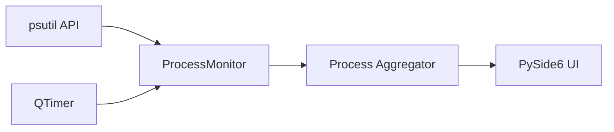

# CLAUDE.md

This file provides guidance to Claude Code (claude.ai/code) when working with code in this repository.

---

## PROJECT OVERVIEW

**Process Monitor** is a Windows desktop gadget for real-time monitoring of CPU and Memory usage per process.

**Key Features:**
- Real-time process monitoring (CPU % and Memory usage)
- Top N current processes display
- Historical high-usage tracking with timestamps
- CPU cores/threads used per process
- Configurable refresh rates and display options

**Tech Stack:**
- Python 3.11+
- PySide6 (Qt6) for GUI
- psutil for system monitoring

**Key Documentation:**
- [README.md](README.md) - Project overview, usage instructions, features

---

## MANDATORY WORKFLOW

**CRITICAL:** Follow this workflow for EVERY task.

### Before Starting Work - ASK QUESTIONS

Before writing ANY code or making ANY changes:

1. **Read the task carefully** - Understand what is being asked
2. **Identify ambiguities** - What is unclear? What could be interpreted multiple ways?
3. **Read relevant documentation** - Check README, comments in code
4. **Ask questions** - NEVER assume, ALWAYS verify
5. **Propose approach** - Explain HOW you will solve it
6. **Only after confirmation** → Start work

---

## DEVELOPMENT RULES

### Rule #1: No Backward Compatibility

**When refactoring, update ALL callers. NEVER add "backward compatibility" wrappers!**

**Procedure:**
1. Search for ALL callers
2. Update EACH caller to use new API
3. Delete old method completely

---

### Rule #2: No Duplicate Code

**Always consider creating shared functions or base classes.**

```python
# FORBIDDEN - same logic in multiple places
class CPUMonitor:
    def format_process(self): ...

class MemoryMonitor:
    def format_process(self): ...  # DUPLICATE!

# REQUIRED - shared base class
class BaseMonitor:
    def format_process(self): ...

class CPUMonitor(BaseMonitor): ...
class MemoryMonitor(BaseMonitor): ...
```

**Before creating new file/function:** Check if similar functionality exists. Extend, don't duplicate.

---

### Rule #3: MD-First Development

**Documentation requirements:**

| Type | Required Documentation |
|------|------------------------|
| Root folder | `README.md` + `CLAUDE.md` |
| Python modules | Docstrings in code |
| Complex features | Separate `.md` if needed |

**Before modifying existing file:**
1. Read its documentation/docstrings
2. Consult if something is unclear
3. Update docs if changing functionality

---

### Rule #4: Constructive Disagreement

**If you know the user's suggestion is not optimal, you MUST:**

1. **Explain WHY** - with concrete technical reasons
2. **Propose alternative** - if better solution exists
3. **Ask for confirmation** - only after user understands trade-off

**Principle:** Better to slow down with discussion than implement inefficient solution.

---

### Rule #5: Language Rules

**Conversation vs Code/Documentation:**

| Context | Language |
|---------|----------|
| Conversation with user | Serbian (Latin script) |
| Code comments | English |
| Documentation files (.md) | English |
| Variable/function names | English |

---

### Rule #6: Commit After Completing Work

**After finishing a task, stage changes and create commits.**

**Commit message format:** `MAJOR.MINOR.PATCH description`

- Follow the existing version sequence — check `git log --oneline -5` for the latest version number
- **Single independent commit** → +1 (e.g., `1.1.180 → 1.1.181`)
- **Group of related commits (same task)** → +10 per commit (e.g., `1.1.180 → 1.1.190 → 1.1.200`)
- Description is short, English, starts with a noun or verb
- Use em dash `—` to separate additional details when needed

**Splitting into multiple commits:**
- Group related changes into logical units
- Each commit should represent one cohesive change
- Complex work = multiple commits, each with its own +10 increment
- Simple work = single commit with +1 increment

**Procedure:**
1. Check the latest version with `git log --oneline -3`
2. Group changes into logical commits (by topic/module)
3. Stage specific files for each commit (`git add file1 file2`, NOT `git add .`)
4. Commit with the next version number and descriptive message
5. Repeat for remaining groups if multiple commits are needed

---

### Rule #7: No Hardcoded Values

**Before hardcoding ANY value, ASK:** "Should this be in `styles.py`?"

```python
# ❌ FORBIDDEN
TIMEOUT = 300
TABLE_ROW_HEIGHT = 28  # hardcoded in function

# ✅ REQUIRED
from app.styles import Dimensions
row_height = Dimensions.TABLE_ROW_HEIGHT
```

All thresholds, dimensions, colors, and tunable values live in `styles.py`. No other file should contain magic numbers.

**When to hardcode:** Only constants that NEVER change (`PI = 3.14159`), enum values, and loop counters.

---

### Rule #8: No Defensive Programming for Impossible Scenarios

**Before adding try/except, ASK:** "Can this scenario actually happen?"

```python
# ❌ FORBIDDEN — checking impossible scenario
def update_table(self, data):
    if data is None:  # Impossible! Monitor always returns a list
        return

# ✅ REQUIRED — trust initialization and internal guarantees
def update_table(self, data):
    for i, process in enumerate(data):
        self._fill_row(i, process)
```

**When defensive code IS appropriate:** External input, file I/O, psutil API calls, OS interactions.

**Principle:** If a scenario is impossible, let it fail loudly. Don't hide bugs with silent fallbacks.

---

### Rule #9: Read-Only on Init

**When starting a new session, only READ documentation — do not suggest changes.**

- Read CLAUDE.md and relevant files to understand the project
- Do NOT propose improvements, additions, or modifications to existing files unprompted
- Purpose of init is context gathering, not a documentation review session

---

### Rule #10: Plans are Discussions

**Plans should be discussions, not code previews.**

- Explain WHAT you will do and WHICH files you will modify
- Do NOT write out full code blocks that will later be copied to files
- Plan = brainstorming, approach discussion
- NOT: "I will write this exact code" → then write the same code again in implementation

---

### Rule #11: Progress Logging for Long Tasks

**Any long-running operation MUST have progress visibility.**

```python
# ❌ FORBIDDEN — silent long-running process
for item in huge_dataset:
    process(item)

# ✅ REQUIRED — progress logging
for i, item in enumerate(huge_dataset):
    process(item)
    if i % 100 == 0:
        print(f"Processing {i}/{total}...")
```

---

### Rule #12: No Capacity Lies

**If a task exceeds my capabilities, I MUST say so honestly.**

- Never claim to have read/processed something I didn't
- Never provide answers based on partial data while implying complete analysis
- Honest "I can't" is infinitely better than fake "I did"

---

### Rule #13: No Error Masking

**Errors MUST be visible. Never hide problems with silent fallbacks.**

```python
# ❌ FORBIDDEN
except Exception:
    pass

# ❌ FORBIDDEN
except Exception:
    result = default_value  # Error hidden!

# ✅ REQUIRED
except SpecificError as e:
    logger.error(f"Operation failed: {e}")
    raise
```

**When fallbacks ARE acceptable:** Explicitly documented behavior, retry logic with eventual failure escalation.

---

## PROJECT STRUCTURE

```
📁 PMUsage/
  🐍 main.py              ← Entry point
  📝 README.md            ← Project documentation
  📝 CLAUDE.md            ← AI assistant guidance
  📁 app/
    🐍 __init__.py
    🐍 main_window.py     ← Main application window
    🐍 settings_dialog.py ← Settings configuration
    🐍 monitor.py         ← Process monitoring logic
    🐍 persistence.py     ← last_setup.json load/save (atomic, corruption-safe)
    🐍 styles.py          ← UI styling constants
    🐍 tray.py            ← System tray icon (single app identity, gadget mode)
  📁 assets/
    🖼️ icon.ico           ← Application icon
    🖼️ icon.svg           ← SVG source
  📁 config/
    📄 config.json         ← Temperature color config
  📁 setup/
    🐍 build.py            ← Build orchestrator (PyInstaller + NSIS)
    🐍 create_cert.py      ← Self-signed certificate generator
    📄 installer.nsi       ← NSIS installer script
```

---

## ARCHITECTURE

### Single Window Application

The application uses a single main window with:
- **Header Section**: Current total usage (CPU % or Memory)
- **Current Processes Table**: Top N processes by resource usage
- **Historical Section**: Highest usage records with timestamps

### Monitor Pattern

```
ProcessMonitor (base)
├── CPUMonitor - CPU percentage per process
└── MemoryMonitor - Memory usage per process
```

### Data Flow



---

## GUIDELINES

### Guideline #1: Verify Before Claiming

**Provide concrete evidence for ANY claim about completed work.**

```
WRONG: "I checked all files" → Must list specific files checked
WRONG: "I fixed the errors" → Must show exact changes made
CORRECT: If unsure → ASK immediately
```

---

### Guideline #2: No Version Suffixes

**Edit files directly - Git stores history!**

```
FORBIDDEN: monitor_v2.py, main_new.py
REQUIRED: monitor.py (edit directly)
```

---

### Guideline #3: Ask Before Deleting

**Before deleting ANY code or file:**
1. Search for all usages
2. Understand what it does
3. ASK if not certain it's obsolete — don't assume

**Rule:** Better 100 questions than 1 deleted core feature.

---

## REMEMBER ALWAYS

1. **ASK questions before work** - Never assume
2. **No Duplicate Code** - Use base classes, inheritance
3. **MD-First** - Read documentation before modifying
4. **Verify Dependencies** - Check what your change affects
5. **When Unsure → ASK** - Better 100 questions than 1 bug
6. **Commit after work** - Version-numbered commits, logical grouping (Rule #6)
7. **No hardcoded values** - Use `styles.py` for all constants (Rule #7)
8. **No capacity lies** - Honest "I can't" > fake "I did" (Rule #12)
9. **No error masking** - Hidden bugs become massive problems (Rule #13)
