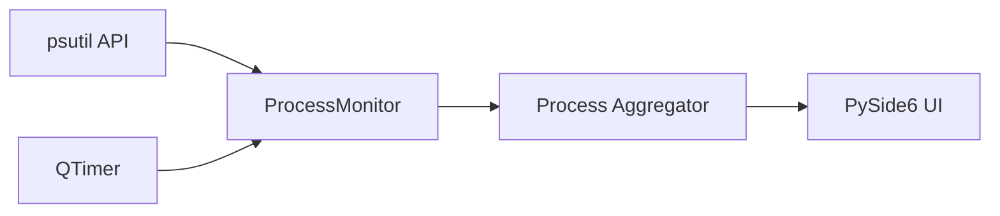

# CLAUDE.md — Vitals (PMUsage)

Project-specific guidance for Claude Code. **Inherits ALL rules from the
monorepo root [CLAUDE.md](../../CLAUDE.md)** (mandatory workflow, Priorities,
Rules #1–#18, markdown guidelines, version/commit system, build pipeline,
py-spy profiling) — read that first; only project facts and deltas live here.

---

## Project Facts

- **Product:** Vitals (formerly PMUsage) — lightweight Windows desktop gadget
  for real-time process monitoring: top N processes by CPU, Memory or Network
  usage, historical peaks with timestamps, CPU cores/threads per process.
  Minimal footprint — always visible without getting in the way.
- **Naming:** display name is **Vitals**; the local folder (`Gadgets/PMUsage/`)
  and the GitHub repo (`UVuruna/ProcessMemoryUsage`) keep their old names.
- **Stack:** Python 3.11+, PySide6 (Qt6), psutil.
- **Architecture:** single main window (header with total usage, current
  processes table, historical section); `ProcessMonitor` base class →
  `CPUMonitor` / `MemoryMonitor`, driven by `QTimer` — Monitor Pattern with
  shared formatting/display logic in the base (root Rule #5).
- **Build:** PyInstaller + NSIS, standard user (no UAC elevation), Registry
  `HKCU` autostart.

## Project Deltas to the Root Rules

- **Config home (root Rule #4):** all thresholds, dimensions, colors and
  tunable values live in `app/styles.py` (plus `config/config.json` for the
  temperature color config). Before hardcoding ANY value, ask: "should this
  be in `styles.py`?"
- Communicate in Serbian (Latin); everything in files stays English.

## Structure

```
📁 PMUsage/
  🐍 main.py              ← Entry point
  📝 README.md            ← Project documentation
  📝 CLAUDE.md            ← This file
  📁 app/
    🐍 main_window.py     ← Main application window
    🐍 settings_dialog.py ← Settings configuration
    🐍 monitor.py         ← Process monitoring logic
    🐍 persistence.py     ← last_setup.json load/save (atomic, corruption-safe)
    🐍 styles.py          ← UI styling constants (the config home)
    🐍 tray.py            ← System tray icon (single app identity, gadget mode)
  📁 assets/              ← icon.svg / icon.ico
  📁 config/              ← config.json (temperature colors)
  📁 setup/               ← build.py, create_cert.py, installer.nsi
```

## Data Flow


