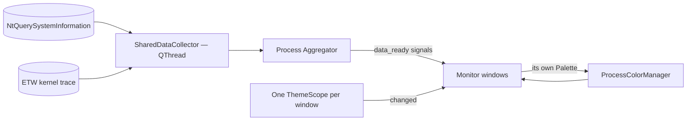

# CLAUDE.md — Vitals (PMUsage)

Project-specific guidance for Claude Code. **Inherits ALL rules from the
monorepo root [CLAUDE.md](../../CLAUDE.md)** (mandatory workflow, Priorities,
Rules #1–#18, markdown guidelines, version/commit system, build pipeline,
py-spy profiling) — read that first; only project facts and deltas live here.

---

## Project Facts

- **Product:** Vitals (formerly PMUsage) — lightweight Windows desktop gadget
  for real-time process monitoring: top N processes by CPU, Memory or Network
  usage, historical peaks with timestamps, CPU cores/threads per process.
  Minimal footprint — always visible without getting in the way.
- **Naming:** display name, local folder (`Gadgets/Vitals/`) and GitHub repo
  (`UVuruna/Vitals`) are all **Vitals** — the PMUsage / ProcessMemoryUsage
  names are historical only.
- **Stack:** Python 3.11+, PySide6 (Qt6), psutil.
- **Architecture:** up to three gadget windows (CPU, Memory, Network), each a
  taskbar-less `Qt.Tool` window built from the shared `BaseMonitorWindow`
  template-method base (root Rule #5). One `SharedDataCollector` QThread feeds
  all of them — a single bulk `NtQuerySystemInformation` call per tick for
  CPU/Memory, an ETW kernel trace for Network. A single tray icon is the app's
  only shell identity and its **Exit** is the only way to quit.
- **Build:** PyInstaller (`--onedir`, `--uac-admin` — the ETW network trace
  needs elevation) + NSIS, Task Scheduler `/rl highest` autostart (Registry
  `Run` is silently skipped for elevated apps).

## Project Deltas to the Root Rules

- **Config home (root Rule #4)** is split by kind:
  - **Colors → `app/theme.py`.** The `DARK` and `LIGHT` palettes are the
    single source of truth for every color, including the process-coloring
    tokens. Read them as `scope.palette` at restyle time — NEVER at import
    time (a module-level f-string or a default argument freezes the palette).
  - **Everything else → `app/styles.py`** (dimensions, switch geometry,
    fonts, defaults, unit tables, formatters) plus `config/config.json`
    (value-color hues and temperature trip points).
  - Before hardcoding ANY value, ask which of the two it belongs in.
- **The theme is PER SCOPE, never global** (owner 2026-07-26). Each monitor
  window owns a `ThemeScope` (`window_theme(key)`); the tray and the setup
  screen use `app_theme()`. There is deliberately NO global `theme()`
  accessor — a widget must not be able to ask "what is the theme?", only
  "what is MY window's theme?", or a one-window flip leaks into the others.
  A new widget therefore **takes its scope (or a plain `Palette`) at
  construction**; it never looks one up.
- **Two flips, and coverage must match reach.** A window header switch calls
  `flip_window_theme(scope, window)` — that window alone, covered alone. The
  setup screen's switch calls `flip_app_theme()` — `set_theme_everywhere()`
  behind covers on every visible window. Never call `set_theme()` directly:
  the covered transition is what the owner asked for, and a bare
  `set_theme()` shows the repaint cascade.
- **Theme flips at runtime.** Any widget that owns a stylesheet must rebuild
  it from `self._theme.palette` in a restyle method connected to
  `self._theme.changed`. The per-mode dialogs are exempt — they are modal and
  cannot see a flip — but the setup screen carries its own switch, so
  `BaseSettingsDialog` widgets register a restyler instead of styling once.
- **Per-item colors need a re-render, not a restyle.** Table cell brushes are
  invisible to stylesheets; `_apply_theme()` re-runs `_render_data()` on the
  last tick so they change with the theme.
- **`ProcessColorManager` is theme-LESS.** It is a singleton shared by all
  three windows, so every getter takes the `Palette` to answer for and it
  holds BOTH themes' shaded ranges at once. Do not give it an "active theme".
- **Compute color variants, never author them twice (root Rule #19).** One
  authored hue set is re-shaded per theme by `shade_for_theme()`. Do not add
  a second light-mode color table.
- Communicate in Serbian (Latin); everything in files stays English.

## Structure

```
📁 Vitals/
  🐍 main.py              ← Entry point
  📝 README.md            ← Project documentation
  📝 CLAUDE.md            ← This file
  📁 app/
    🐍 main_window.py     ← Main application window
    🐍 settings_dialog.py ← Settings configuration
    🐍 monitor.py         ← Process monitoring logic
    🐍 color_management.py ← Ranked company colors + value color zones
    🐍 theme.py           ← Dark/Light palettes + per-window ThemeScope (the COLOR config home)
    🐍 theme_switch.py    ← DayNightSwitch (sun/moon pill; per-window and global)
    🐍 icons.py           ← SVG rendering + per-theme tinting
    🐍 transition.py      ← Snapshot-cover fade that hides a theme flip
    🐍 window_manager.py  ← Owns the three monitor windows (lazy create, shared settings)
    🐍 persistence.py     ← last_setup.json load/save (atomic, corruption-safe)
    🐍 styles.py          ← Dimensions, fonts, defaults, formatters (non-color config home)
    🐍 tray.py            ← System tray icon (single app identity, gadget mode)
  📁 assets/              ← icon.svg / icon.ico
    📁 icons/             ← One master SVG per icon (glyphs + Day/Night switch art)
  📁 config/              ← config.json (value color hues, temperature thresholds)
  📁 setup/               ← build.py, create_cert.py, installer.nsi
```

## Data Flow



Each window pushes ITS palette into the color manager rather than the
manager reading one active theme — that is what lets CPU be dark while
Memory is light.
