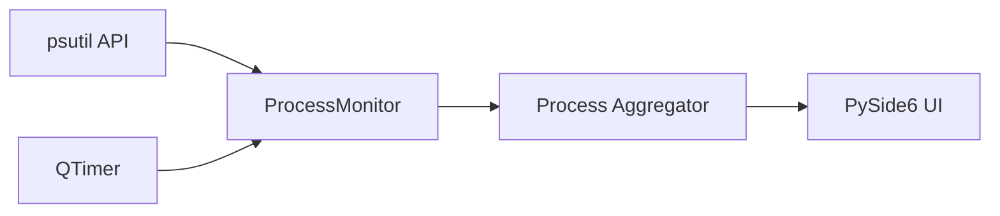

# CLAUDE.md

This file provides guidance to Claude Code (claude.ai/code) when working with code in this repository.

---

## PROJECT OVERVIEW

**Process Monitor** is a Windows desktop gadget for real-time monitoring of CPU and Memory usage per process.

**Key Features:**
- Real-time process monitoring (CPU % and Memory usage)
- Top N current processes display
- Historical high-usage tracking with timestamps
- CPU cores/threads used per process
- Configurable refresh rates and display options

**Tech Stack:**
- Python 3.11+
- PySide6 (Qt6) for GUI
- psutil for system monitoring

**Key Documentation:**
- [README.md](README.md) - Project overview, usage instructions, features

---

## MANDATORY WORKFLOW

**CRITICAL:** Follow this workflow for EVERY task.

### Before Starting Work - ASK QUESTIONS

Before writing ANY code or making ANY changes:

1. **Read the task carefully** - Understand what is being asked
2. **Identify ambiguities** - What is unclear? What could be interpreted multiple ways?
3. **Read relevant documentation** - Check README, comments in code
4. **Ask questions** - NEVER assume, ALWAYS verify
5. **Propose approach** - Explain HOW you will solve it
6. **Only after confirmation** → Start work

---

## DEVELOPMENT RULES

### Rule #1: No Backward Compatibility

**When refactoring, update ALL callers. NEVER add "backward compatibility" wrappers!**

**Procedure:**
1. Search for ALL callers
2. Update EACH caller to use new API
3. Delete old method completely

---

### Rule #2: No Duplicate Code

**Always consider creating shared functions or base classes.**

```python
# FORBIDDEN - same logic in multiple places
class CPUMonitor:
    def format_process(self): ...

class MemoryMonitor:
    def format_process(self): ...  # DUPLICATE!

# REQUIRED - shared base class
class BaseMonitor:
    def format_process(self): ...

class CPUMonitor(BaseMonitor): ...
class MemoryMonitor(BaseMonitor): ...
```

**Before creating new file/function:** Check if similar functionality exists. Extend, don't duplicate.

---

### Rule #3: MD-First Development

**Documentation requirements:**

| Type | Required Documentation |
|------|------------------------|
| Root folder | `README.md` + `CLAUDE.md` |
| Python modules | Docstrings in code |
| Complex features | Separate `.md` if needed |

**Before modifying existing file:**
1. Read its documentation/docstrings
2. Consult if something is unclear
3. Update docs if changing functionality

---

### Rule #4: Constructive Disagreement

**If you know the user's suggestion is not optimal, you MUST:**

1. **Explain WHY** - with concrete technical reasons
2. **Propose alternative** - if better solution exists
3. **Ask for confirmation** - only after user understands trade-off

**Principle:** Better to slow down with discussion than implement inefficient solution.

---

### Rule #5: Language Rules

**Conversation vs Code/Documentation:**

| Context | Language |
|---------|----------|
| Conversation with user | Serbian (Latin script) |
| Code comments | English |
| Documentation files (.md) | English |
| Variable/function names | English |

---

### Rule #6: Commit After Completing Work

**After finishing a task, stage changes and create commits.**

**Commit message format:** `MAJOR.MINOR.PATCH description`

- Follow the existing version sequence — check `git log --oneline -5` for the latest version number
- Increment the patch number by 10 for each commit (e.g., `1.1.180` → `1.1.190`)
- Description is short, English, starts with a noun or verb
- Use em dash `—` to separate additional details when needed

**Splitting into multiple commits:**
- Group related changes into logical units
- Each commit should represent one cohesive change
- Complex work = multiple commits, each with its own version increment
- Simple work = single commit

**Procedure:**
1. Check the latest version with `git log --oneline -3`
2. Group changes into logical commits (by topic/module)
3. Stage specific files for each commit (`git add file1 file2`, NOT `git add .`)
4. Commit with the next version number and descriptive message
5. Repeat for remaining groups if multiple commits are needed

---

## PROJECT STRUCTURE

```
📁 PMUsage/
  🐍 main.py              ← Entry point
  📝 README.md            ← Project documentation
  📝 CLAUDE.md            ← AI assistant guidance
  📁 app/
    🐍 __init__.py
    🐍 main_window.py     ← Main application window
    🐍 settings_dialog.py ← Settings configuration
    🐍 monitor.py         ← Process monitoring logic
    🐍 styles.py          ← UI styling constants
  📁 assets/
    🖼️ icon.ico           ← Application icon
    🖼️ icon.svg           ← SVG source
  📁 config/
    📄 config.json         ← Temperature color config
  📁 setup/
    🐍 build.py            ← Build orchestrator (PyInstaller + NSIS)
    🐍 create_cert.py      ← Self-signed certificate generator
    📄 installer.nsi       ← NSIS installer script
```

---

## ARCHITECTURE

### Single Window Application

The application uses a single main window with:
- **Header Section**: Current total usage (CPU % or Memory)
- **Current Processes Table**: Top N processes by resource usage
- **Historical Section**: Highest usage records with timestamps

### Monitor Pattern

```
ProcessMonitor (base)
├── CPUMonitor - CPU percentage per process
└── MemoryMonitor - Memory usage per process
```

### Data Flow



---

## GUIDELINES

### Guideline #1: Verify Before Claiming

**Provide concrete evidence for ANY claim about completed work.**

```
WRONG: "I checked all files" → Must list specific files checked
WRONG: "I fixed the errors" → Must show exact changes made
CORRECT: If unsure → ASK immediately
```

---

### Guideline #2: No Version Suffixes

**Edit files directly - Git stores history!**

```
FORBIDDEN: monitor_v2.py, main_new.py
REQUIRED: monitor.py (edit directly)
```

---

## REMEMBER ALWAYS

1. **ASK questions before work** - Never assume
2. **No Duplicate Code** - Use base classes, inheritance
3. **MD-First** - Read documentation before modifying
4. **Verify Dependencies** - Check what your change affects
5. **When Unsure → ASK** - Better 100 questions than 1 bug
6. **Commit after work** - Version-numbered commits, logical grouping (Rule #6)
