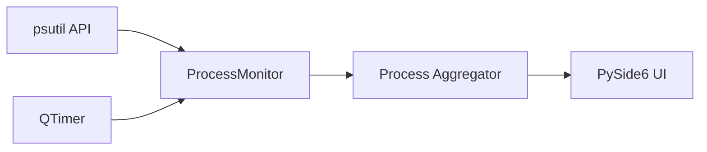

# CLAUDE.md — Vitals (PMUsage)

Project-specific guidance for Claude Code. **Inherits ALL rules from the
monorepo root [CLAUDE.md](../../CLAUDE.md)** (mandatory workflow, Priorities,
Rules #1–#18, markdown guidelines, version/commit system, build pipeline,
py-spy profiling) — read that first; only project facts and deltas live here.

---

## Project Facts

- **Product:** Vitals (formerly PMUsage) — lightweight Windows desktop gadget
  for real-time process monitoring: top N processes by CPU, Memory or Network
  usage, historical peaks with timestamps, CPU cores/threads per process.
  Minimal footprint — always visible without getting in the way.
- **Naming:** display name is **Vitals**; the local folder (`Gadgets/PMUsage/`)
  and the GitHub repo (`UVuruna/ProcessMemoryUsage`) keep their old names.
- **Stack:** Python 3.11+, PySide6 (Qt6), psutil.
- **Architecture:** single main window (header with total usage, current
  processes table, historical section); `ProcessMonitor` base class →
  `CPUMonitor` / `MemoryMonitor`, driven by `QTimer` — Monitor Pattern with
  shared formatting/display logic in the base (root Rule #5).
- **Build:** PyInstaller + NSIS, standard user (no UAC elevation), Registry
  `HKCU` autostart.

## Project Deltas to the Root Rules

- **Config home (root Rule #4)** is split by kind:
  - **Colors → `app/theme.py`.** The `DARK` and `LIGHT` palettes are the
    single source of truth for every color, including the process-coloring
    tokens. Read them with `theme()` at restyle time — NEVER at import time
    (a module-level f-string or a default argument freezes the palette).
  - **Everything else → `app/styles.py`** (dimensions, switch geometry,
    fonts, defaults, unit tables, formatters) plus `config/config.json`
    (value-color hues and temperature trip points).
  - Before hardcoding ANY value, ask which of the two it belongs in.
- **Theme flips at runtime.** Any widget that owns a stylesheet must rebuild
  it from `theme()` in a restyle method connected to
  `theme_manager().changed`. Modal dialogs are exempt — the theme cannot
  change while one is open, so they read the palette once at construction.
- **Compute color variants, never author them twice (root Rule #19).** One
  authored hue set is re-shaded per theme by `shade_for_theme()`. Do not add
  a second light-mode color table.
- Communicate in Serbian (Latin); everything in files stays English.

## Structure

```
📁 PMUsage/
  🐍 main.py              ← Entry point
  📝 README.md            ← Project documentation
  📝 CLAUDE.md            ← This file
  📁 app/
    🐍 main_window.py     ← Main application window
    🐍 settings_dialog.py ← Settings configuration
    🐍 monitor.py         ← Process monitoring logic
    🐍 color_management.py ← Ranked company colors + value color zones
    🐍 theme.py           ← Dark/Light palettes + ThemeManager (the COLOR config home)
    🐍 theme_switch.py    ← DayNightSwitch (sun/moon pill in each header)
    🐍 icons.py           ← SVG rendering + per-theme tinting
    🐍 persistence.py     ← last_setup.json load/save (atomic, corruption-safe)
    🐍 styles.py          ← Dimensions, fonts, defaults, formatters (non-color config home)
    🐍 tray.py            ← System tray icon (single app identity, gadget mode)
  📁 assets/              ← icon.svg / icon.ico
    📁 icons/             ← One master SVG per icon (glyphs + Day/Night switch art)
  📁 config/              ← config.json (value color hues, temperature thresholds)
  📁 setup/               ← build.py, create_cert.py, installer.nsi
```

## Data Flow


