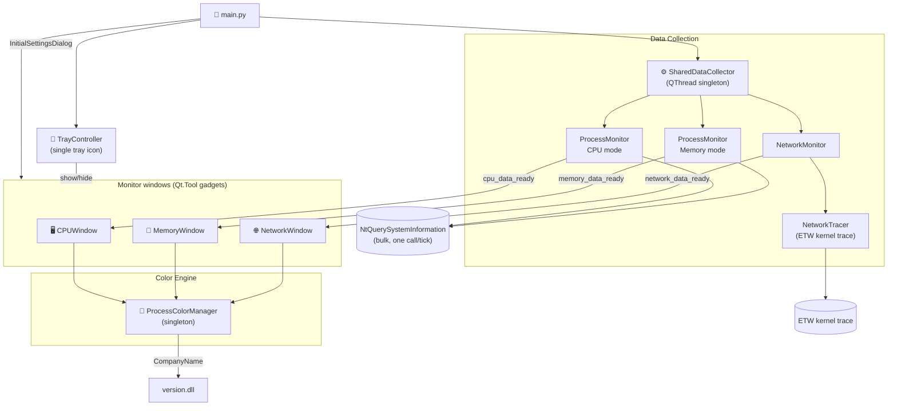
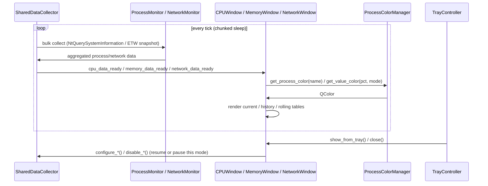

# 🖥️ Process Monitor

> Real-time CPU, Memory, and Network usage monitoring for Windows — lightweight desktop gadget windows controlled from a single tray icon, with company-based coloring and historical peak tracking.

---

## ✨ Features

| Feature | Description |
|---------|-------------|
| 🔄 **Real-time Monitoring** | Live updates of CPU %, Memory, and Network per process |
| 🪟 **Three Monitor Modes** | CPU, Memory, and Network monitors — open any combination as independent gadget windows |
| 🖥️ **Desktop Gadget Mode** | Windows have no taskbar button and no Alt-Tab entry; a single tray icon is the app's only shell identity |
| 🧰 **System Tray Control** | The tray icon's menu shows/hides each window and is the only way to quit — closing a window just hides it |
| ↩️ **Reopen From Tray** | Double-click the tray icon, or check a window in its menu, to bring back a hidden monitor and resume its data collection |
| 🌐 **Network Monitor** | Per-process download/upload speed via a Windows ETW kernel trace — requires Administrator privileges |
| 🎨 **Company Coloring** | Processes colored by company (Microsoft, Adobe, …) — hues distributed evenly across 360° |
| 📊 **Value Color Scale** | Usage % mapped to 5 color zones — independent scales for CPU, Memory, and Network (download/upload) |
| 🗂️ **Process Aggregation** | Groups sub-processes (all Chrome tabs → "Chrome") |
| 📈 **Historical Tracking** | Records peak usage with timestamps, auto-expires |
| 📉 **Rolling Average** | Toggleable second view showing each process's average usage and active time across the retention window |
| 🧵 **Thread Count** | Parallel threads per process (CPU mode) |
| 💾 **Persistent Setup** | Last-used settings, window layout, and color thresholds restored automatically on next launch |
| 🔁 **Pause / Resume** | Freeze the display without stopping collection |
| ↕️ **Resizable Panels** | Drag the splitter between current and history/rolling tables |

---

## 🚀 Quick Start

```bash
# 1. Install dependencies
pip install PySide6 psutil

# 2. Run
python main.py
```

---

## 🖱️ Usage

1. **Launch** — `python main.py` (or run the installed `PMUsage.exe`)
2. **Select monitors** — choose CPU, Memory, and/or Network (any combination)
3. **Adjust settings** — rows, refresh rate, retention time, memory/network units, color thresholds
4. **Click "Start Monitoring"** — settings are saved and restored next launch
5. **Close a window to hide it** — its data collection pauses; use the tray icon's menu (or double-click) to bring it back, or **Exit** (File menu or tray menu) to quit the app entirely

### ⌨️ Keyboard Shortcuts

| Key | Action |
|-----|--------|
| `Space` | Pause / Resume monitoring |
| `Esc` | Hide the active monitor window (pauses its data collection; reopen from the tray icon) |

---

## ⚙️ Configuration

### Setup Dialog

| Setting | Range | Default | Description |
|---------|-------|---------|-------------|
| Monitor Mode | CPU / Memory / Network (any combination) | CPU | Which monitors to open |
| Current processes | 1 – 100 | 7 | Rows in the current table |
| History records | 1 – 100 | 4 | Rows in the history table |
| Refresh rate | 500 – 5000 ms | 1000 ms | Data update interval |
| History retention | 10 – 360 min | 120 min | How long history and rolling-average records are kept |
| Font size | 8 – 18 pt | 11 pt | Scales all window text and table row height proportionally |
| Memory unit | KB / MB / GB | MB | Unit for memory values |
| Network unit / sort / max speed | KB/s or MB/s; sort by total, download, or upload; max Mbps (0 = auto-detect) | MB/s, total, auto | Network window display options (only shown when Network is selected) |
| Color thresholds | 4 draggable handles per scale | 3 / 8 / 20 / 40 % | Zone boundaries on each color scale |

Each window also has its own **Settings** dialog (File > Settings) for
adjusting these values after startup, plus its own color-threshold scales.
Settings are saved to `config/last_setup.json` and loaded on next launch.

### Color Scale

The color bar shows 5 usage zones. Drag the 4 diamond handles to move zone boundaries:

```
 ████░░░░░░░░░░░░░░░░░░░░░░░░░░░░░░░░░░░░░
 blue  green    yellow   orange       red
 0%    3%       8%       20%    40%   100%
       ◆        ◆        ◆      ◆
```

CPU and Memory maintain **independent** threshold sets — adjusting one doesn't affect the other.

### config/config.json

Edit to change default color zones:

```json
{
  "value_colors": {
    "ranges": [
      {"max_pct": 3,   "color": "#5B9BD5"},
      {"max_pct": 8,   "color": "#6AAF6A"},
      {"max_pct": 20,  "color": "#C8B040"},
      {"max_pct": 40,  "color": "#D4803A"},
      {"max_pct": 100, "color": "#C85555"}
    ]
  }
}
```

---

## 🎨 Company Coloring

Process names are colored by the company listed in each executable's PE version info (read via `version.dll`), in three tiers:

- 🟣 **Multi-company** (2+ active process names) — individual hue assigned dynamically: `hue = index / N × 360°`.
  As new multi-companies are discovered N grows and all hues shift, keeping them evenly spread.
- 🟤 **Singleton company** (exactly 1 active process name) — shares a single "Other" color (last hue slot).
- ⬜ **No company info** — fixed near-white (`#D2D2D2`)

The **Company Legend** button (in the CPU/Memory/Network settings dialogs) shows which color belongs to which company, how many processes each has, and lets you expand "Other"/"Unknown" to see the individual process names.

---

## 🏗️ Architecture

Process Monitor runs as a **desktop gadget**: each monitor window is a
`Qt.Tool` window (no taskbar button, no Alt-Tab entry), and a single system
tray icon is the app's only persistent shell identity. Closing a window
hides it and pauses its data collection; the tray icon's menu (or a
double-click) brings it back, and its **Exit** action — or File > Exit — is
the only way to quit.



### Data Flow



---

## 📁 Project Structure

See the [App Module](app/__index.md) documentation for the full component
breakdown, data flow, and links to every class/function reference below it.

```
📁 PMUsage/
  🐍 main.py                ← Entry point
  📝 README.md              ← This file
  📝 CLAUDE.md              ← AI assistant guidance
  📁 app/
    📝 __index.md           ← App module overview
    🐍 main_window.py       ← BaseMonitorWindow, CPUWindow, MemoryWindow, NetworkWindow
    🐍 settings_dialog.py   ← InitialSettingsDialog, CPUSettingsDialog, MemorySettingsDialog, NetworkSettingsDialog
    🐍 monitor.py           ← SharedDataCollector, ProcessMonitor, NetworkMonitor, RollingWindow
    🐍 network_monitor.py   ← NetworkTracer (ETW kernel trace for per-process network bytes)
    🐍 color_management.py  ← ProcessColorManager (company hues + value color zones)
    🐍 persistence.py       ← last_setup.json load/save (atomic, corruption-safe)
    🐍 styles.py            ← UI constants (dark palette, fonts, dimensions)
    🐍 tray.py              ← System tray icon (single app identity, gadget mode)
    🐍 process_actions.py   ← Kill / set priority / open file location
    🐍 process_dialog.py    ← Kill-confirm and priority-selection dialogs
  📁 config/
    📄 config.json           ← Value color thresholds (editable)
    📄 last_setup.json       ← Last-used settings (auto-generated)
  📁 assets/
    🖼️ icon.ico             ← Application icon
    🖼️ icon.svg             ← SVG source
  📁 setup/
    🐍 build.py             ← Build orchestrator (PyInstaller + NSIS)
    🐍 create_cert.py       ← Self-signed certificate generator
    📄 installer.nsi         ← NSIS installer script
```

---

## 🔧 Building from Source

```bash
# Full build (ICO → PyInstaller → sign → NSIS installer)
python setup/build.py
```

**Prerequisites:**
- `pip install pyinstaller pillow`
- [NSIS](https://nsis.sourceforge.io/) installed and on PATH
- Optional: run `python setup/create_cert.py` once for code signing

Output: `dist/PMUsage_Setup.exe`

---

## 📋 Requirements

| Requirement | Version |
|-------------|---------|
| Python | 3.11+ |
| PySide6 | ≥ 6.5.0 |
| psutil | ≥ 5.9.0 |
| Windows | 10 / 11 |
