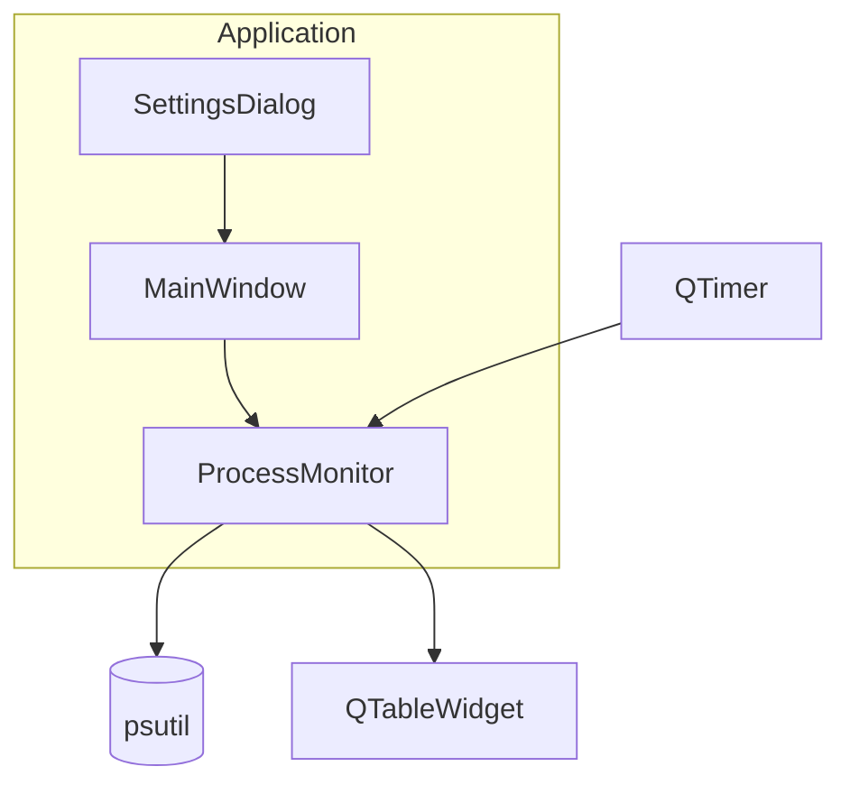

# Process Monitor

Real-time CPU and Memory usage monitoring for Windows processes.

---

## Table of Contents

- [Overview](#overview)
- [Features](#features)
- [Quick Start](#quick-start)
- [Usage](#usage)
- [Configuration](#configuration)
- [Architecture](#architecture)
- [Project Structure](#project-structure)

---

<a id="overview"></a>

## Overview

**Process Monitor** is a lightweight Windows desktop gadget that displays real-time resource usage per process. Track which applications consume the most CPU and Memory, with historical tracking of peak usage.

### Key Highlights

| Feature | Description |
|---------|-------------|
| **Real-time Monitoring** | Live updates of CPU % and Memory per process |
| **Dual Mode** | Switch between CPU and Memory monitoring |
| **Process Aggregation** | Groups sub-processes (e.g., all Chrome tabs as "Chrome") |
| **Historical Tracking** | Records highest usage with timestamps |
| **CPU Cores Display** | Shows how many cores each process uses |

---

<a id="features"></a>

## Features

### Current Processes

Displays top N processes sorted by resource usage:
- Process name
- Resource usage (CPU % or Memory in KB/MB/GB)
- CPU cores used (for CPU mode)

### Historical High Usage

Tracks processes that reached peak usage:
- Process name with timestamp
- Maximum resource value recorded
- Auto-removes after configurable time period

### Configurable Display

- Number of current processes to show (1-15)
- Number of historical records to keep (1-15)
- Refresh rate (500ms - 5000ms)
- Historical retention time (10-360 minutes)
- Memory units (KB, MB, GB)

---

<a id="quick-start"></a>

## Quick Start

```bash
# 1. Install dependencies
pip install PySide6 psutil

# 2. Run the application
python main.py
```

---

<a id="usage"></a>

## Usage

1. **Launch** - Run `python main.py`
2. **Configure** - Settings dialog opens on first run
3. **Select Mode** - Choose CPU or Memory monitoring
4. **Adjust Settings** - Set display preferences
5. **Start** - Click "Start" to begin monitoring

### Keyboard Shortcuts

| Key | Action |
|-----|--------|
| `Esc` | Close settings / Exit |
| `Space` | Pause/Resume monitoring |

---

<a id="configuration"></a>

## Configuration

### Settings Dialog

| Setting | Description | Default |
|---------|-------------|---------|
| **Monitor Mode** | CPU or Memory | CPU |
| **Current Rows** | Processes to display | 7 |
| **History Rows** | Historical records | 4 |
| **Refresh Rate** | Update interval (ms) | 2000 |
| **Retention Time** | Keep history (min) | 120 |
| **Memory Units** | KB, MB, or GB | MB |
| **CPU Threads** | Total CPU threads | Auto-detect |
| **RAM Amount** | Total RAM (GB) | Auto-detect |

---

<a id="architecture"></a>

## Architecture

### Component Overview



### Data Flow

1. **QTimer** triggers monitor update at configured interval
2. **ProcessMonitor** queries psutil for all processes
3. **Aggregator** groups processes by name (Chrome, VS Code, etc.)
4. **Sorter** orders by resource usage (descending)
5. **UI** displays in tables with formatting

### Process Aggregation

Similar processes are grouped together:
- `Code.exe`, `Code Helper.exe` → **Visual Studio Code**
- `chrome.exe` (multiple) → **Chrome**
- `msedge.exe`, `msedgewebview2.exe` → **Microsoft Edge**

---

<a id="project-structure"></a>

## Project Structure

```
📁 ProcessMemoryUsage/
  🐍 main.py              ← Entry point - run this
  📝 README.md            ← This file
  📝 CLAUDE.md            ← AI assistant guidance
  📁 app/
    📝 __index.md         ← App module documentation
    🐍 __init__.py        ← Package init
    🐍 main_window.py     ← Main application window
    🐍 settings_dialog.py ← Settings configuration dialog
    🐍 monitor.py         ← Process monitoring logic
    🐍 styles.py          ← UI colors and styling
```

### Module Descriptions

| Module | Purpose |
|--------|---------|
| [main.py](main.py) | Application entry point |
| [app/main_window.py](app/main_window.md) | Main window with tables and headers |
| [app/settings_dialog.py](app/settings_dialog.md) | Configuration dialog |
| [app/monitor.py](app/monitor.md) | psutil integration, process data |
| [app/styles.py](app/styles.md) | Colors, fonts, dimensions |

---

## Requirements

- Python 3.11+
- Windows 10/11
- PySide6
- psutil

---

## Legacy Files

The following files are from the original tkinter implementation and kept for reference:
- `Window.py` - Original UI (tkinter)
- `CalculatingFunctions.py` - Original monitoring logic
- `MemoryUsage.py` - Original Memory entry point
- `ProcessorUsage.py` - Original CPU entry point

These can be safely deleted after verifying the new implementation works.
