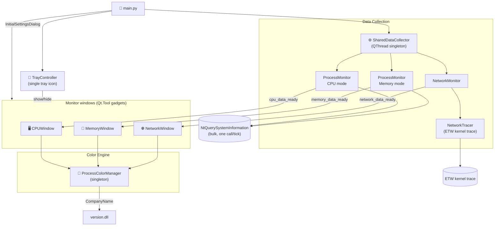
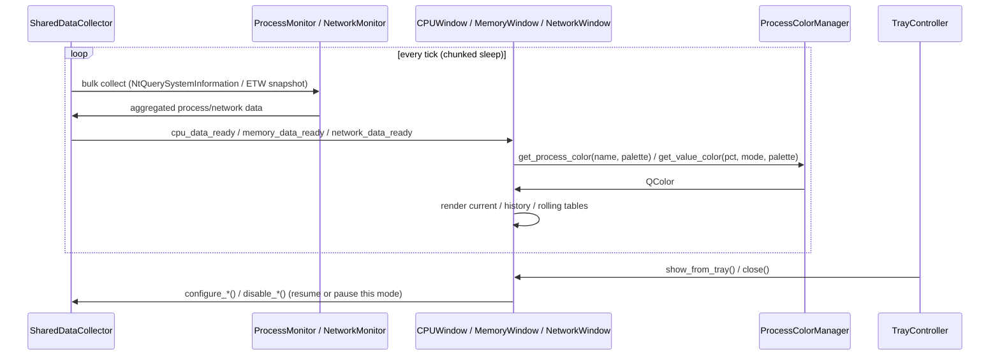

# 🖥️ Vitals

> Real-time CPU, Memory, and Network usage monitoring for Windows — lightweight desktop gadget windows controlled from a single tray icon, with dark/light themes, company-based coloring and historical peak tracking. Formerly named PMUsage.

---

## ✨ Features

| Feature | Description |
|---------|-------------|
| 🔄 **Real-time Monitoring** | Live updates of CPU %, Memory, and Network per process |
| 🪟 **Three Monitor Modes** | CPU, Memory, and Network monitors — open any combination as independent gadget windows |
| 🖥️ **Desktop Gadget Mode** | Windows have no taskbar button and no Alt-Tab entry; a single tray icon is the app's only shell identity |
| 🧰 **System Tray Control** | The tray icon's menu shows/hides each window and is the only way to quit — closing a window just hides it |
| ↩️ **Reopen From Tray** | Double-click the tray icon, or check a window in its menu, to bring back a hidden monitor and resume its data collection |
| 🌐 **Network Monitor** | Per-process download/upload speed via a Windows ETW kernel trace — requires Administrator privileges |
| 🌗 **Dark & Light Themes** | A sun/moon switch in every window header flips **that window alone**, so CPU can be dark while Memory is light; the switch on the setup screen is the global one and flips all three. Every flip runs behind a sun/moon fade, and each window remembers its own choice |
| 🎛️ **One Settings Screen** | The tray's **Settings** opens the setup screen — every monitor's rows, refresh rate, retention, units and fonts in one place |
| 🎨 **Company Coloring** | Processes colored by company (Microsoft, Adobe, …) — the busiest company is plain white/black, the rest walk a blue → red scale by process count |
| 📊 **Value Color Scale** | Usage % mapped to 5 color zones — independent scales for CPU, Memory, and Network (download/upload) |
| 🗂️ **Process Aggregation** | Groups sub-processes (all Chrome tabs → "Chrome") |
| 📈 **Historical Tracking** | Records peak usage with timestamps, auto-expires |
| 📉 **Rolling Average** | Toggleable second view showing each process's average usage and active time across the retention window |
| 🧵 **Thread Count** | Parallel threads per process (CPU mode) |
| 💾 **Persistent Setup** | Last-used settings, window layout, and color thresholds restored automatically on next launch |
| 🔁 **Pause / Resume** | Freeze the display without stopping collection |
| ↕️ **Resizable Panels** | Drag the splitter between current and history/rolling tables |

---

## 🚀 Quick Start

```bash
# 1. Install dependencies
pip install PySide6 psutil

# 2. Run
python main.py
```

---

## 🖱️ Usage

1. **Launch** — `python main.py` (or run the installed `Vitals.exe`)
2. **Select monitors** — choose CPU, Memory, and/or Network (any combination)
3. **Adjust settings** — rows, refresh rate, retention time, memory/network units, color thresholds
4. **Click "Start Monitoring"** — settings are saved and restored next launch
5. **Close a window to hide it** — the monitor keeps running; use the tray icon's menu (or double-click) to bring it back, or the tray menu's **Exit** to quit the app entirely
6. **Reconfigure any time** — the tray menu's **Settings** reopens this same screen; enabling a monitor there opens its window on the spot
7. **Lost a window?** — the tray menu's **Reset window positions** brings every gadget back to the centre of the screen (sizes, themes and column widths are kept)

### 🎛️ Window Header

```
[⏸/▶] [⚙]     CPU ......................... 54.2% (3.38%)
[ ~switch~ ]   Temperature     Power      Electric
                 58.9°C        38.4 W      18.5 A
```

| Control | Action |
|---------|--------|
| ⏸ / ▶ | Pause / resume the display |
| ⚙ | Open this monitor's settings |
| 🌙 / ☀️ pill | Flip **this window** between the dark and light theme. The other windows keep theirs — use the switch on the setup screen (tray → **Settings**) to flip all three at once |

The title and the total value always share one row. When no HWiNFO sensors
are available the sensor row disappears and the control block centres against
the title.

### ⌨️ Keyboard Shortcuts

| Key | Action |
|-----|--------|
| `Space` | Pause / Resume monitoring |
| `Esc` | Hide the active monitor window (pauses its data collection; reopen from the tray icon) |

---

## ⚙️ Configuration

### Setup Dialog

| Setting | Range | Default | Description |
|---------|-------|---------|-------------|
| Monitor Mode | CPU / Memory / Network (any combination) | CPU | Which monitors to open |
| Current processes | 1 – 100 | 7 | Rows in the current table |
| History records | 1 – 100 | 4 | Rows in the history table |
| Refresh rate | 500 – 5000 ms | 1000 ms | Data update interval |
| History retention | 10 – 360 min | 120 min | How long history and rolling-average records are kept |
| Font size | 8 – 18 pt | 11 pt | Scales all window text and table row height proportionally |
| Memory unit | KB / MB / GB | MB | Unit for memory values |
| Network unit / sort / max speed | KB/s or MB/s; sort by total, download, or upload; max Mbps (0 = auto-detect) | MB/s, total, auto | Network window display options (only shown when Network is selected) |
| Color thresholds | 4 draggable handles per scale | 3 / 8 / 20 / 40 % | Zone boundaries on each color scale |

Each window also has its own **Settings** dialog (File > Settings) for
adjusting these values after startup, plus its own color-threshold scales.
Settings are saved to `config/last_setup.json` and loaded on next launch.

### Color Scale

The color bar shows 5 usage zones. Drag the 4 diamond handles to move zone boundaries:

```
 ████░░░░░░░░░░░░░░░░░░░░░░░░░░░░░░░░░░░░░
 blue  green    yellow   orange       red
 0%    3%       8%       20%    40%   100%
       ◆        ◆        ◆      ◆
```

CPU and Memory maintain **independent** threshold sets — adjusting one doesn't affect the other.

### config/config.json

Edit to change the default color zones and the temperature trip points. The
colors listed here are **hues only** — each theme re-shades them (lighter on
dark, darker on light), so there is no second table to maintain:

```json
{
  "temp_colors": {
    "warning_threshold": 60,
    "critical_threshold": 75
  },
  "value_colors": {
    "ranges": [
      {"max_pct": 3,   "color": "#5B9BD5"},
      {"max_pct": 8,   "color": "#6AAF6A"},
      {"max_pct": 20,  "color": "#C8B040"},
      {"max_pct": 40,  "color": "#D4803A"},
      {"max_pct": 100, "color": "#C85555"}
    ]
  }
}
```

---

## 🎨 Company Coloring

Process names are colored by the company listed in each executable's PE version info (read via `version.dll`), **ranked by how many processes each company runs**:

- ⬜ **Most processes** — plain contrast: **white** on the dark theme, **black** on the light one. In practice this is the OS vendor, so the busiest name in the table stays neutral.
- 🔵→🔴 **Every other named company** — a **blue → red** wheel, running counter-clockwise through cyan, green and yellow as the process count drops. Rank 2 is blue; the last slot is red.
- 🟤 **Singleton company** (exactly 1 active process name) — shares the last ("Other") red slot.
- ⬛ **No company info** — the reserved **gray**, never part of the wheel.

Ranks are recomputed every refresh from the processes actually running, so the legend's order is exactly the color order. Saturation and lightness are tunable **per theme** from the legend's sliders.

The **Company Legend** button (in the CPU/Memory/Network settings dialogs) shows which color belongs to which company, how many processes each has, and lets you expand "Other"/"Unknown" to see the individual process names.

---

## 🏗️ Architecture

Vitals runs as a **desktop gadget**: each monitor window is a
`Qt.Tool` window (no taskbar button, no Alt-Tab entry), and a single system
tray icon is the app's only persistent shell identity. Closing a window
just hides it — the collector keeps running; the tray icon's menu (or a
double-click) brings it back, and its **Exit** action is the only way to
quit.



### Data Flow



---

## 📁 Project Structure

```
📁 Vitals/
  🐍 main.py                ← Entry point
  📝 README.md              ← This file
  📝 CLAUDE.md              ← AI assistant guidance
  📝 OPEN-QUESTIONS.md      ← Decisions awaiting the owner
  📁 __about/               ← Docs for the root-level script
  📁 __flow/                ← Its startup diagram
  📁 app/
    📁 collect/             ← Data acquisition: Windows queries, per-mode stats, collector thread
    📁 dialogs/             ← Setup screen, per-monitor settings dialogs, process dialogs
    📁 windows/             ← The three gadget windows and everything they are built from
    🐍 theme.py             ← Dark/Light palettes + per-window ThemeScope (the COLOR config home)
    🐍 styles.py            ← Dimensions, fonts, defaults, formatters (non-color config home)
    🐍 settings.py          ← The four settings dataclasses and their persistence
    🐍 color_management.py  ← Ranked company colors + value color zones
    🐍 persistence.py       ← last_setup.json load/save (atomic, corruption-safe)
    🐍 icons.py             ← SVG rendering + per-theme tinting
    🐍 theme_switch.py      ← DayNightSwitch (the sun/moon pill)
    🐍 transition.py        ← Snapshot-cover fade that hides a theme flip
    🐍 process_actions.py   ← Kill / set priority / open file location
    🐍 startup.py           ← Start-with-Windows registration
    🐍 tray.py              ← System tray icon (single app identity, gadget mode)
    🐍 window_manager.py    ← Owns the three monitor windows
  📁 config/
    ⚙️ config.json          ← Value color thresholds (editable)
    ⚙️ last_setup.json      ← Last-used settings (auto-generated)
  📁 assets/
    🖼️ icon.ico             ← Application icon
    🖼️ icon.svg             ← SVG source
  📁 setup/                 ← Build pipeline (PyInstaller + NSIS + signing)
  📁 tests/                 ← The four enforcement guards
```

### 📚 Documentation Map

Every `.md` file in the project is reachable from here.

| Entry point | What it covers |
|-------------|----------------|
| [App (folder)](app/___app.md) | The whole application: shared services, data flow, and the three subpackages |
| [Collect (subfolder)](app/collect/___collect.md) | Windows queries, HWiNFO, the ETW trace, per-mode statistics, the collector thread |
| [Dialogs (subfolder)](app/dialogs/___dialogs.md) | The setup screen, the three per-monitor dialogs, the process dialogs |
| [Windows (subfolder)](app/windows/___windows.md) | The gadget windows, placement, tables, status banner, process menu |
| [Entry Point](__about/main.md) | What `main.py` wires together at startup |
| [Setup (folder)](setup/___setup.md) | The 7-step build pipeline and its fail-closed verify gate |
| [Tests (folder)](tests/___tests.md) | The four guard tests and the hooks that run them |
| [Vitals CLAUDE.md](CLAUDE.md) | Project facts and the deltas that tighten the monorepo rules |
| [Open Questions](OPEN-QUESTIONS.md) | Judgments made autonomously, and code observations awaiting a decision |

---

## 🔧 Building from Source

```bash
# Full build (ICO → PyInstaller → sign → NSIS installer)
python setup/build.py
```

**Prerequisites:**
- `pip install pyinstaller pillow`
- [NSIS](https://nsis.sourceforge.io/) installed and on PATH
- Optional: run `python setup/create_cert.py` once for code signing

Output: `dist/Vitals_Setup.exe`

---

## 📋 Requirements

| Requirement | Version |
|-------------|---------|
| Python | 3.11+ |
| PySide6 | ≥ 6.5.0 |
| psutil | ≥ 5.9.0 |
| Windows | 10 / 11 |
