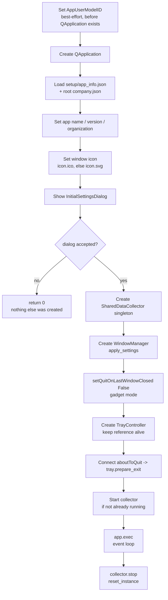

# Entry Point — Flow

**About:** [description](../__about/main.md)

## Startup sequence

Pseudocode (language-neutral):

    SET AppUserModelID                      # best-effort, before QApplication exists — cosmetic taskbar grouping
    CREATE QApplication

    app_info = READ setup/app_info.json
    company  = READ root company.json       # bundled at exe root when frozen, two levels up in dev
    SET app name/version/organization FROM app_info, company
    SET window icon (icon.ico, else icon.svg)

    SHOW InitialSettingsDialog
    IF dialog rejected -> RETURN 0          # quit before any long-lived object exists

    settings  = dialog.get_settings()
    collector = NEW SharedDataCollector()   # singleton
    manager   = NEW WindowManager(settings, collector)
    manager.apply_settings(settings)

    app.setQuitOnLastWindowClosed(False)    # gadget mode: only the tray's Exit action quits
    tray = NEW TrayController(icon, manager)   # kept alive for the app's lifetime
    CONNECT app.aboutToQuit -> tray.prepare_exit

    IF NOT collector.isRunning() -> collector.start()

    result = app.exec()                     # blocks until the app quits

    collector.stop()
    SharedDataCollector.reset_instance()
    RETURN result

## Why `prepare_exit` is wired twice

The tray's **Exit** menu action calls `prepare_exit()` synchronously inside
its own click handler, then calls `QApplication.quit()`. The `aboutToQuit`
connection made in step above calls the *same* `prepare_exit()` again for
every OTHER way the app can end (an OS session logoff, a signal, anything
that does not go through the Exit menu item).

Both routes need the same guarantee: every window and the tray icon
disappear **together**, instantly, **before** the slow teardown starts —
`collector.stop()` joins the collector `QThread`, and stopping it tears down
the ETW kernel trace, both of which can take a moment. If hiding only
happened inside the `aboutToQuit` handler, the Exit click would sit waiting
on that teardown with stale windows still on screen; running it synchronously
in the click handler first makes the disappearance instant, and the second,
idempotent run via `aboutToQuit` makes the same guarantee hold for every
route that never went through the Exit menu at all.
