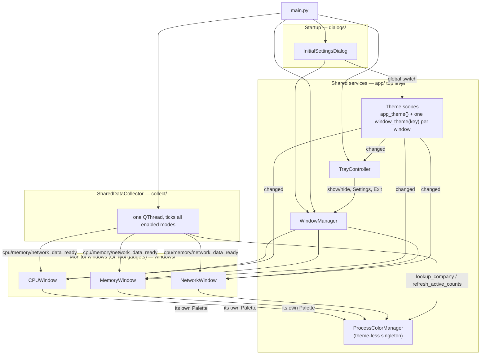

# app/

The application package: every shared service, the three data-acquisition,
dialog and window subpackages, and the app's entry-point wiring. Vitals runs
as a desktop gadget — up to three monitor windows (CPU, Memory, Network),
each a taskbar-less `Qt.Tool` window, fed by one shared background collector
thread and controlled through a single system tray icon. This top level
holds the services every subpackage depends on: the Dark/Light theme engine,
the non-color config home, ranked process/value coloring, the theme-flip
snapshot cover, the Day/Night switch, SVG icon rendering, `last_setup.json`
persistence, the settings shape, Windows autostart, live process actions,
the tray shell, and the window manager that owns the three gadgets as one
group.

## Structure

```
📁 app/
  🐍 __init__.py            ← package exports
  🐍 theme.py                ← Dark/Light palettes, per-scope theme flip — the COLOR config home
  🐍 styles.py                ← dimensions, fonts, defaults, formatters — the NON-color config home
  🐍 color_management.py      ← ranked company colors + value-threshold color mapping
  🐍 transition.py             ← the snapshot-cover fade that hides a theme flip
  🐍 theme_switch.py           ← DayNightSwitch — the sun/moon pill toggle
  🐍 icons.py                  ← SVG rendering + per-theme tinting
  🐍 persistence.py            ← last_setup.json load/save (atomic, corruption-safe)
  🐍 settings.py               ← InitialSettings + the three per-mode settings dataclasses
  🐍 startup.py                ← Windows autostart (Task Scheduler / HKCU Run)
  🐍 process_actions.py        ← kill / set priority / open file location
  🐍 tray.py                   ← TrayController — single tray icon, gadget-mode shell identity
  🐍 window_manager.py         ← owns the three monitor windows (lazy create, shared settings)
  📁 collect/                  ← data acquisition: Windows queries, per-mode stats, the collector thread
  📁 dialogs/                  ← the setup screen, per-monitor dialogs, process dialogs
  📁 windows/                  ← the three gadget windows and everything they are built from
  📁 __about/                  ← one doc per module below (this folder's own files only)
  📁 __flow/                   ← one flow diagram per Algorithmic module below
```

## Files

| File | Tier | One line |
|------|------|----------|
| `theme.py` | Algorithmic | Dark/Light palettes + per-scope theme flip — the color config home — [about](__about/theme.md) · [flow](__flow/theme.md) |
| `styles.py` | Algorithmic | Dimensions, fonts, defaults, unit tables, formatters — the non-color config home — [about](__about/styles.md) · [flow](__flow/styles.md) |
| `color_management.py` | Algorithmic | Ranked company colors + per-mode value-threshold colors, theme-less — [about](__about/color_management.md) · [flow](__flow/color_management.md) |
| `transition.py` | Algorithmic | Snapshot-cover fade that hides a theme repaint cascade — [about](__about/transition.md) · [flow](__flow/transition.md) |
| `theme_switch.py` | Standard | `DayNightSwitch` — the sun/moon pill, dumb about reach — [about](__about/theme_switch.md) |
| `icons.py` | Standard | SVG rendering, per-theme tinting, `IconButton` — [about](__about/icons.md) |
| `persistence.py` | Standard | `last_setup.json` access point, bundled vs. writable paths — [about](__about/persistence.md) |
| `settings.py` | Standard | `InitialSettings` + `CPUSettings`/`MemorySettings`/`NetworkSettings` — [about](__about/settings.md) |
| `startup.py` | Standard | Windows autostart — Task Scheduler (frozen) / HKCU Run (dev) — [about](__about/startup.md) |
| `process_actions.py` | Standard | Kill / set priority / open file location on live `psutil.Process` objects — [about](__about/process_actions.md) |
| `tray.py` | Standard | `TrayController` — the app's single shell identity in gadget mode — [about](__about/tray.md) |
| `window_manager.py` | Standard | Owns the three monitor windows: lazy creation, shared settings, exit — [about](__about/window_manager.md) |
| `__init__.py` | Trivial | Re-exports the package's public API (windows, dialogs, settings, theme scopes, `WindowManager`) |

## Subpackages

| Subpackage | Responsibility |
|------------|-----------------|
| [Collect (subfolder)](collect/___collect.md) | Data acquisition — bulk `NtQuerySystemInformation`, the ETW network trace, HWiNFO sensors, per-mode stat readers, and the `SharedDataCollector` thread that ticks them all |
| [Dialogs (subfolder)](dialogs/___dialogs.md) | The setup screen (the app's front door) and every settings / process-action dialog |
| [Windows (subfolder)](windows/___windows.md) | The three gadget windows (`CPUWindow`, `MemoryWindow`, `NetworkWindow`) and everything they are built from |

## Connections

### Uses
- [Collect (subfolder)](collect/___collect.md) — the shared data source every window and `WindowManager` reads
- [Dialogs (subfolder)](dialogs/___dialogs.md) — the setup screen `main.py` shows before any window exists, and every settings dialog opened from a window or the tray
- [Windows (subfolder)](windows/___windows.md) — the three gadget windows `WindowManager` owns

### Used by
- `main.py` — the entry point: shows `InitialSettingsDialog`, then builds the `SharedDataCollector`, the `WindowManager` and the `TrayController`, and runs `app.exec()`

## Data Flow



Each window pushes ITS palette into `ProcessColorManager` rather than the
manager reading one active theme — that is what lets CPU be dark while
Memory is light. `SharedDataCollector` and its per-mode stat readers are the
`collect/` subpackage; every dialog is `dialogs/`; every window and its
chrome is `windows/` — see their own folder docs for the acquisition and UI
detail this diagram omits.

## Design Decisions

- **The theme is per SCOPE, never global (owner 2026-07-26).** There is
  deliberately no global `theme()` accessor — a widget may only ask "what is
  MY window's theme?", never "what is THE theme?". Each monitor window owns
  its own `ThemeScope` (`window_theme(key)`); the tray and the setup screen
  share `app_theme()`. A new widget takes its scope (or a plain `Palette`)
  at construction and never looks one up — see [Theme](__about/theme.md).
- **Config is split by kind, not by convenience.** Every color, including
  the process-coloring data tokens, lives in [Theme](__about/theme.md)'s
  `DARK`/`LIGHT` palettes — the single source of truth. Everything that is
  NOT a color (dimensions, switch geometry, fonts, defaults, unit tables,
  formatters) lives in [Styles](__about/styles.md), plus `config/config.json`
  for value-color hues and temperature trip points. The question "should
  this be hardcoded?" always resolves to "is it a color?" first.
- **Colors are computed, never enumerated (root Rule #19).** There is no
  second, hand-authored light-mode color table anywhere in the app. One
  authored hue set is re-shaded per theme by `shade_for_theme()`
  ([Theme](__about/theme.md)), and the process-coloring wheel is generated
  from two endpoints (`wheel_hue`) rather than a list of named colors — see
  [Color Management (flow)](__flow/color_management.md).
- **Gadget mode: `Qt.Tool` windows plus one tray identity.** Monitor windows
  have no taskbar button and no Alt-Tab entry, so a single system tray icon
  ([Tray](__about/tray.md)) is the app's only persistent shell identity —
  its menu is the way to bring a hidden gadget back, and its Exit is the
  ONLY way to quit. This is also why [Window Manager](__about/window_manager.md)
  never destroys a window once created: hiding is enough, and destroying one
  would throw away its running peak/history record for nothing.
