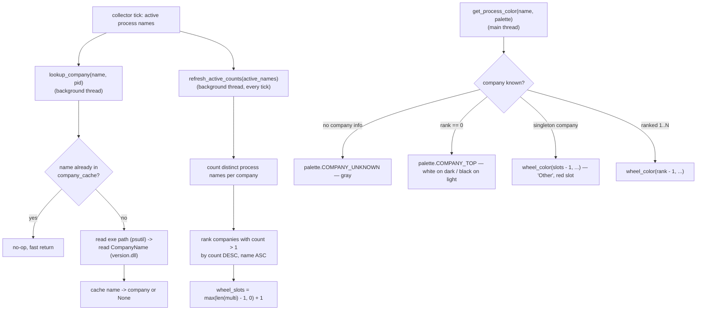
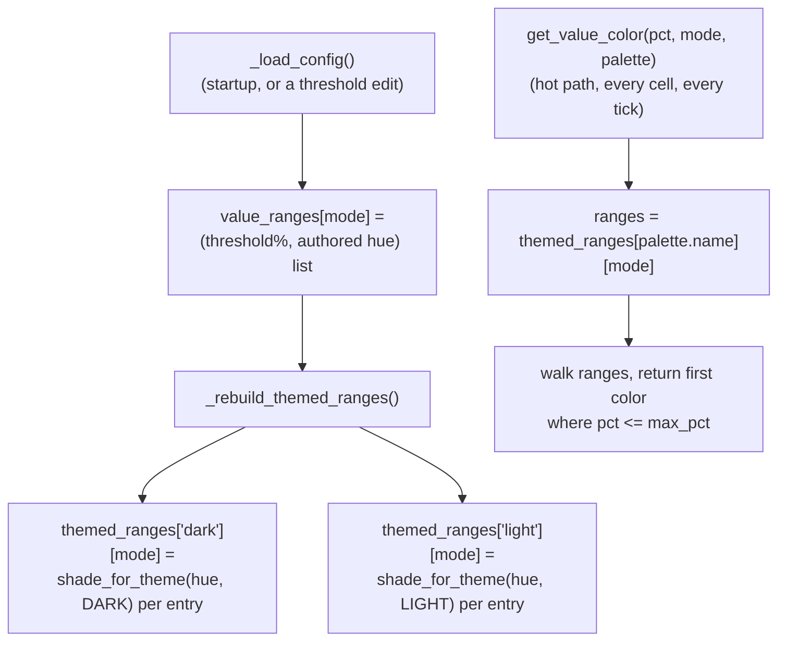

# Color Management — Flow

**About:** [description](../__about/color_management.md)

Two independent pipelines share the module: one colors a PROCESS by which
company made it, the other colors a VALUE by how high it is. Both end at the
same kind of answer — `get_..._color(..., palette)` — but derive it very
differently.

## Pipeline 1 — company coloring

Pseudocode for the ranking step, which runs every refresh from the ACTIVE
process set (not a frozen discovery order):

    FOR EACH active process display name:
        company = company_cache[name]           # may be None
        IF company -> counts[company] += 1

    multi = companies with counts > 1, sorted by (-count, name)
    rank[company] = index of company IN multi    # 0 = most processes
    wheel_slots = max(len(multi) - 1, 0) + 1      # ranks 1.. plus "Other"

    FUNCTION slot_color(company):
        IF rank[company] == 0        -> COMPANY_TOP contrast color
        ELSE IF company is a singleton -> wheel slot (wheel_slots - 1)  # "Other"
        ELSE                          -> wheel slot (rank[company] - 1)

The wheel itself runs blue (slot 0) to red (last slot), see
[Theme (flow)](theme.md)'s `wheel_hue`.

## Pipeline 2 — value coloring

Unlike company colors, value colors are shaded for BOTH themes UP FRONT, so
the per-cell refresh hot path never re-shades anything:

Pseudocode:

    ON load OR ON a threshold edit:
        FOR EACH mode:
            authored = [(threshold_pct, hue) ...]     # from config.json or an edit
        FOR EACH theme IN {DARK, LIGHT}:
            themed_ranges[theme][mode] = [(t, shade_for_theme(hue, theme)) for (t, hue) IN authored]

    FUNCTION get_value_color(pct, mode, palette):        # hot path
        ranges = themed_ranges[palette.name][mode]        # dict lookup
        FOR (max_pct, color) IN ranges:                    # plain list walk
            IF pct <= max_pct -> RETURN color
        RETURN ranges[-1].color

Rebuilding BOTH shades together — rather than invalidating one on a theme
flip — is what lets a dark CPU window and a light Memory window read correct
colors from the same cache at the same instant.
