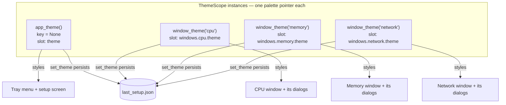

# Theme — Flow

**About:** [description](../__about/theme.md)

## The palette tree

Every color token a `Palette` carries, grouped by what it styles:

```
Palette
  Surfaces        BACKGROUND, CARD, HEADER, BORDER, SECTION_BG
  Accent          ACCENT, ACCENT_HOVER
  Confirm         CONFIRM, CONFIRM_HOVER          (Priority dialog's Apply)
  Text            TEXT, TEXT_MUTED, TEXT_DIM, TEXT_FAINT, TEXT_DISABLED
  Icon            ICON, ICON_HOVER                (header pause/settings glyphs)
  Temperature     TEMP_WARNING, TEMP_CRITICAL     (HWiNFO sensor readout)
  Process coloring
    COMPANY_TOP       plain contrast (white on dark / black on light)
    COMPANY_UNKNOWN   reserved gray, never part of the wheel
  Wheel params    HUE_SATURATION, HUE_LIGHTNESS   (company wheel defaults)
  Value colors    VALUE_LIGHTNESS                 (target lightness for usage hues)
```

Two complete instances exist — `DARK` and `LIGHT` — registered in `THEMES`.
Every field is a plain hex string; nothing here is computed except the
process/value colors downstream, which re-shade FROM these tokens
(see [Color Management (flow)](color_management.md)).

## The scope model



No widget ever holds a reference to more than one scope. A window's header
switch calls `set_theme()` on that window's own scope only; the setup
screen's switch is the sole caller that reaches every scope at once.

### `set_theme(name)` — one scope

```
FUNCTION set_theme(scope, name):
    palette = THEMES[name]
    IF palette IS ALREADY scope's active palette -> return   # no-op, no signal
    scope's palette = palette
    persist name into scope's OWN last_setup.json slot
        (key None -> "theme", key "cpu" -> "windows.cpu.theme", ...)
    emit scope.changed
```

Every restyled widget connects to `changed` and simply re-reads
`scope.palette` — nothing downstream needs to know WHY the palette changed.

### `set_theme_everywhere(name)` — the global flip

```
FUNCTION set_theme_everywhere(name):
    app_theme().set_theme(name)
    FOR EACH live window scope (only ones created so far):
        scope.set_theme(name)

    # A window not opened this session has no live ThemeScope — only a
    # remembered entry in last_setup.json. Without this step, opening it
    # later would resurrect the theme it carried before the global change.
    FOR EACH saved window entry whose remembered theme != name:
        overwrite that entry's theme -> name
    save last_setup.json
```

This is what the setup screen's Day/Night switch calls (through
[flip_app_theme()](transition.md)) — a window-header switch never calls it,
it only ever moves its own scope.
