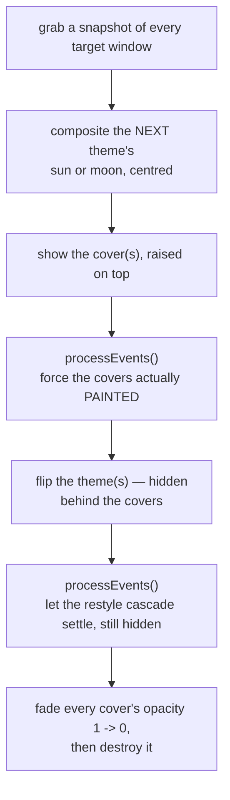
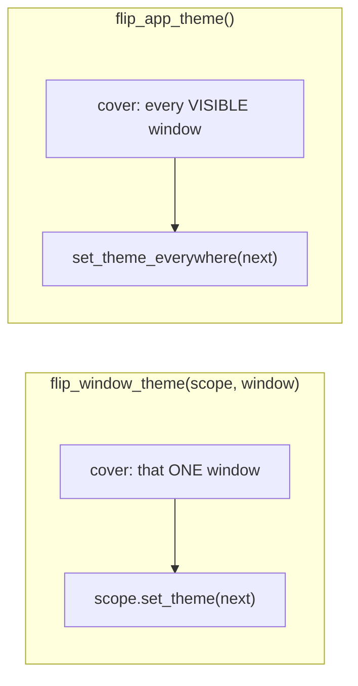

# Theme Transition — Flow

**About:** [description](../__about/transition.md)

## The cover sequence

Pseudocode — both public entry points share this exact body, differing only
in WHICH scope(s) flip and WHICH windows are covered:

    FUNCTION flip(scope-or-all, targets):
        next  = the theme being switched TO
        icon  = SUN if next is light, else MOON

        FOR EACH target window:
            cover = frozen snapshot of that window, with `icon` drawn centred
            show the cover on top of it

        processEvents()          # covers must be PAINTED before anything changes
        switch the theme(s)      # the whole repaint cascade happens hidden
        processEvents()          # let the cascade settle, still hidden
        FOR EACH cover:
            fade opacity 1 -> 0, then close

## The two reaches

- `flip_window_theme()` — a monitor window's own header switch. Covers only
  that window; the other two gadgets are not repainting and are never
  frozen.
- `flip_app_theme()` — the setup screen's global switch. Covers every
  currently visible window, then calls `set_theme_everywhere()` (see
  [Theme (flow)](theme.md)), which also updates the REMEMBERED theme of a
  window that is not open yet.

The order is what removes the visible jump: covers painted BEFORE anything
underneath changes, cascade settled BEFORE the fade starts. Reversing either
step lets the cascade show through.
