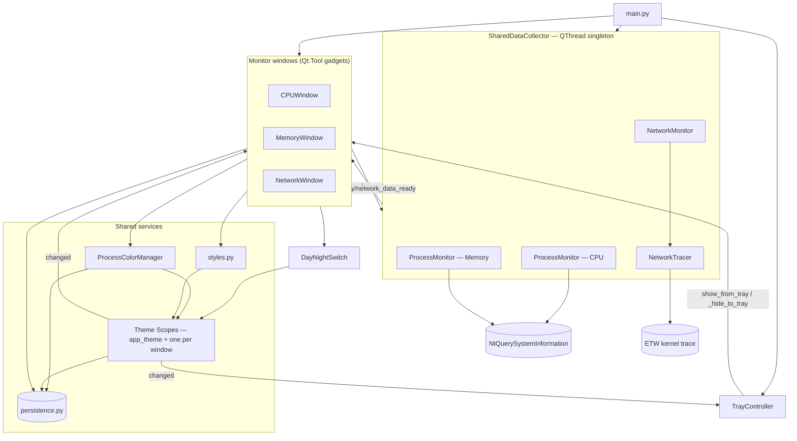

# App Module

This folder contains every GUI and business-logic component of Process
Monitor, built with PySide6 (Qt6).

---

## Purpose

Vitals runs as a **desktop gadget**: up to three monitor windows
(CPU, Memory, Network), each a taskbar-less `Qt.Tool` window, fed by one
shared background collector thread and controlled through a single system
tray icon. Closing a window only hides it — the collector keeps running; the
tray icon's **Exit** is the only way to actually quit.

Both a **Dark** and a **Light** theme ship. Each window owns its own theme —
the Day/Night switch in its header flips that window alone — while the setup
screen carries a second, GLOBAL switch that flips every window at once.

---

## Structure

```
📁 app/
  🐍 __init__.py            ← Package exports
  🐍 main_window.py         ← BaseMonitorWindow, CPUWindow, MemoryWindow, NetworkWindow
  🐍 settings_dialog.py     ← InitialSettingsDialog, CPUSettingsDialog, MemorySettingsDialog, NetworkSettingsDialog
  🐍 monitor.py             ← SharedDataCollector, ProcessMonitor, NetworkMonitor, RollingWindow
  🐍 network_monitor.py     ← NetworkTracer (ETW kernel trace), get_link_speed_mbps
  🐍 color_management.py    ← ProcessColorManager (ranked company colors + value color zones)
  🐍 theme.py               ← Dark/Light palettes, ThemeScope (per-window + app-wide), color-wheel and shading math
  🐍 theme_switch.py        ← DayNightSwitch (the sun/moon pill in each header)
  🐍 icons.py               ← SVG rendering, theme tinting, IconButton
  🐍 transition.py          ← The snapshot-cover fade that hides a theme flip
  🐍 window_manager.py      ← Owns the three monitor windows (lazy create, shared settings)
  🐍 persistence.py         ← last_setup.json load/save (atomic, corruption-safe), base/data path resolution
  🐍 tray.py                ← TrayController (single tray icon, gadget-mode shell identity)
  🐍 styles.py              ← Dimensions, switch geometry, fonts, defaults, formatting helpers
  🐍 process_actions.py     ← Kill / set priority / open file location (live psutil operations)
  🐍 process_dialog.py      ← Kill-confirm and priority-selection dialogs
  📁 ../assets/icons/       ← One master SVG per icon (glyphs + switch art)
```

---

## Modules

| Module | Documentation | Description |
|--------|---------------|-------------|
| Main Window | [Main Window](main_window.md) | The three gadget windows and their shared base class |
| Settings Dialog | [Settings Dialog](settings_dialog.md) | Launcher and per-mode settings dialogs, color-scale widget, company legend |
| Monitor | [Monitor](monitor.md) | Background collector thread, per-mode monitors, rolling averages |
| Network Monitor | [Network Monitor](network_monitor.md) | ETW kernel trace for per-process network bytes |
| Color Management | [Color Management](color_management.md) | Ranked company colors and value-threshold color mapping |
| Theme | [Theme](theme.md) | The Dark/Light palettes and the live theme flip — every color in the app |
| Day/Night Switch | [Day/Night Switch](theme_switch.md) | The sun/moon pill that flips the theme |
| Icons | [Icons](icons.md) | SVG rendering, per-theme tinting, the header icon buttons |
| Theme Transition | [Theme Transition](transition.md) | The snapshot cover + sun/moon fade that hides a theme flip |
| Window Manager | [Window Manager](window_manager.md) | Owns the three monitor windows: lazy creation, shared settings, exit |
| Persistence | [Persistence](persistence.md) | `last_setup.json` access point, bundled vs. writable paths |
| Tray Controller | [Tray Controller](tray.md) | Single tray icon — the app's shell identity in gadget mode |
| Styles | [Styles](styles.md) | Dimensions, switch geometry, fonts, defaults, formatting functions |

`process_actions.py` and `process_dialog.py` have no separate module doc —
see their usage under [Main Window](main_window.md)'s Connections section.

---

## Data Flow



1. **Startup** — `main.py` shows `InitialSettingsDialog`, hands its settings
   to the `WindowManager` (which creates the enabled windows and wires
   CPU/Memory as refresh-rate peers), and starts the one
   `SharedDataCollector` thread and one `TrayController`.
2. **Collection** — each tick, the collector makes a single bulk
   `NtQuerySystemInformation` call (CPU/Memory) and reads the ETW tracer's
   accumulated bytes (Network), then emits a data-ready signal per enabled mode.
3. **Display** — each window's `_on_data_ready()` fills its current/history/
   rolling tables, coloring cells via `ProcessColorManager`.
4. **Gadget lifecycle** — the windows are `Qt.Tool` gadgets (native title bar,
   normal move/resize) with no taskbar/Alt-Tab presence. Closing a window (its
   X, `Esc`, the tray checkbox, or the tray **Minimize** which drops all at
   once) only hides it — the collector keeps running, so peaks/history stay
   continuous. The tray icon's **double-click toggles** all windows (hides them
   if any is visible, else re-shows them all); the per-window checkbox brings a
   single one back via `show_from_tray()`. The tray menu's **Exit** is the only
   path to `QApplication.quit()`.
   Every show also runs `place_on_screen()`, the single authority on window
   placement and the only code that reasons in FRAME rather than CLIENT
   coordinates — a saved position whose title bar would land above the screen
   is corrected instead of stranding a gadget that has no taskbar or Alt-Tab
   route back. The tray's **Reset window positions** is the manual escape
   hatch. See [Main Window](main_window.md) and
   [Window Manager](window_manager.md).
5. **Theme** — each monitor window owns its own `ThemeScope`
   (`window_theme(key)`); the app owns one more (`app_theme()`) for the tray
   menu and the setup screen. Two switches trigger two different flips:
     - A window header's switch calls `flip_window_theme(scope, window)`:
       ONLY that window is covered by a snapshot with the incoming sun/moon
       on it; behind the cover the window's own scope persists the choice
       and emits `changed`, so only that window restyles, re-renders its
       last tick, and its own switch slides to match — the other two
       gadgets never repaint.
     - The setup screen's switch calls `flip_app_theme()`: every VISIBLE
       window is covered, then `set_theme_everywhere()` moves the app scope,
       every live window scope, and the remembered theme of any window not
       currently open, so a window opened later doesn't resurrect a stale
       choice. Every covered window restyles/re-renders and the tray menu
       restyles. The covers then fade out either way.
   `ProcessColorManager` needs no signal from either flip: it holds BOTH
   themes' derived colors at once and simply answers whichever palette the
   caller passes in.
6. **Reconfiguring** — the tray's **Settings** action reopens the setup
   screen; `WindowManager.apply_settings()` pushes the result into every
   monitor and opens or hides windows to match the mode toggles.
