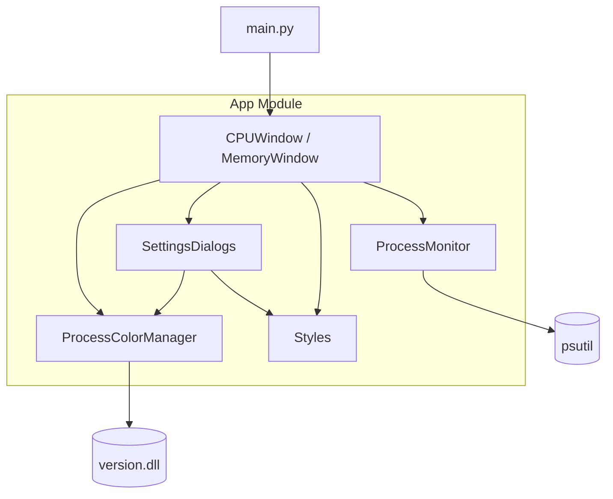

# App Module

This folder contains the core application components for Process Monitor.

---

## Purpose

The `app` module provides all GUI and business logic components for the Process Monitor application, built with PySide6 (Qt6).

---

## Structure

```
📁 app/
  🐍 __init__.py           ← Package exports
  🐍 main_window.py        ← Main application window (CPUWindow, MemoryWindow)
  🐍 settings_dialog.py   ← Configuration dialogs (Initial, CPU, Memory)
  🐍 monitor.py            ← Process monitoring logic
  🐍 color_management.py  ← Company and value-based process coloring
  🐍 styles.py             ← UI styling constants
```

---

## Components

| Component | Documentation | Description |
|-----------|---------------|-------------|
| CPUWindow / MemoryWindow | [main_window.md](main_window.md) | Monitor windows with tables and controls |
| Settings Dialogs | [settings_dialog.md](settings_dialog.md) | Initial, CPU, and Memory configuration dialogs |
| ProcessMonitor | [monitor.md](monitor.md) | psutil integration for data collection |
| ProcessColorManager | [color_management.md](color_management.md) | Company hue assignment and value color mapping |
| Styles | [styles.md](styles.md) | Colors, fonts, dimensions |

---

## Architecture



---

## Data Flow

1. **Startup**: `main.py` creates `MainWindow`
2. **Configuration**: `SettingsDialog` collects user preferences
3. **Monitoring**: `ProcessMonitor` queries psutil at intervals
4. **Display**: Tables update with formatted data

---

## Usage

```python
from app import MainWindow

# Create and show
window = MainWindow()
window.show()
```
