# Collector — Flow

**About:** [description](../__about/collector.md)

## `run()` — one tick

```mermaid
flowchart TB
    A[loop while _running] --> B[snapshot settings + monitors + tracer under the mutex]
    B --> C{network tracer.is_dead?}
    C -- yes --> D[tracer.stop — OUTSIDE the mutex, joins the consumer thread; then re-lock to null the tracer and record the TraceFailure]
    C -- no --> E[need_cpu / need_mem / need_net = enabled AND configured AND — for network — a live tracer]
    D --> E
    E --> F{network enabled, settings present, but no live tracer?}
    F -- yes --> G[emit network_data_ready with empty processes and the TraceFailure]
    F -- no --> H
    G --> H{need_cpu or need_mem or need_net?}
    H -- no --> Z[sleep in COLLECTOR_SLEEP_CHUNK_MS chunks, loop]
    H -- yes --> I[collect_processes_bulk — ONE NtQuerySystemInformation call for this tick]
    I --> J[ProcessColorManager: lookup_company per aggregated process; refresh_active_counts]
    J --> K[hwinfo = cpu_monitor.get_hwinfo_data — or an empty HWiNFOData if no CPU monitor]
    K --> L{need_cpu?}
    L -- yes --> M[extract_cpu_top, update_history, update_rolling_average -> emit cpu_data_ready]
    L --> N{need_mem?}
    M --> N
    N -- yes --> O[extract_mem_top, update_history, update_rolling_average -> emit memory_data_ready]
    N --> P{need_net?}
    O --> P
    P -- yes --> Q[snapshot_and_reset ETW bytes; process_snapshot; update_history -> emit network_data_ready]
    P --> Z
    Q --> Z
```

Pseudocode (language-neutral):

    WHILE running:
        LOCK mutex:
            read enabled flags, monitor instances, settings, tracer, interval
        UNLOCK

        IF tracer exists AND tracer.is_dead():
            failure = tracer.error OR a generic CONSUMER_DIED TraceFailure
            tracer.stop()                    // joins the consumer thread — NEVER under the mutex
            LOCK mutex: clear tracer, store failure  UNLOCK

        need_cpu = cpu enabled AND cpu monitor configured
        need_mem = memory enabled AND memory monitor configured
        need_net = network enabled AND network monitor configured AND a live tracer

        IF network enabled but no live tracer:
            emit network_data_ready(empty processes, error = current failure)

        IF need_cpu OR need_mem OR need_net:
            aggregated, total_cpu, total_rss, pid_to_name = collect_processes_bulk(...)   // ONE call
            register/refresh process names in the color manager
            hwinfo = cpu_monitor.get_hwinfo_data() if a CPU monitor exists else empty

            IF need_cpu: extract top CPU processes, update history + rolling average, emit cpu_data_ready
            IF need_mem: extract top Memory processes, update history + rolling average, emit memory_data_ready
            IF need_net: read + reset ETW byte counters, compute rates, update history, emit network_data_ready

        SLEEP in COLLECTOR_SLEEP_CHUNK_MS-sized chunks until `interval` has
        elapsed or running was cleared — so stop() interrupts within one
        chunk instead of waiting out a full slow-refresh-rate interval

One bulk query and one color-manager pass serve every enabled mode — three
open windows cost exactly what one costs, which is the reason
[Collector](../__about/collector.md) exists as a single thread rather than
one per window.
