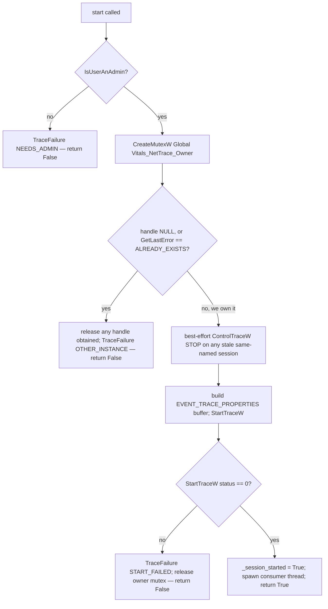

# Network Trace — Flow

**About:** [description](../__about/network_trace.md)

## `start()` — session lifecycle and its failure states



## Consumer thread — where a "successful" start can still die later

```mermaid
flowchart TB
    A[_consume thread starts] --> B[OpenTraceW]
    B --> C{handle valid?}
    C -- no --> D[TraceFailure CONSUMER_DIED — OpenTraceW failed; _running = False]
    C -- yes --> E[ProcessTrace — BLOCKS until the session stops]
    E --> F{ProcessTrace status != 0?}
    F -- yes --> G[TraceFailure CONSUMER_DIED — ProcessTrace failed]
    F -- no, returned cleanly --> H{was stop() called — _stopping true?}
    H -- yes --> I[clean shutdown — no failure recorded]
    H -- no --> J[TraceFailure CONSUMER_DIED — session was stopped externally]
    D --> K[_running = False either way]
    G --> K
    I --> K
    J --> K
```

## `is_dead()` — telling a died consumer apart from a clean stop

    is_dead() = _session_started AND NOT _running AND NOT _stopping

`start()` returns as soon as the consumer thread is spawned — every real
failure inside that thread (`OpenTraceW`, `ProcessTrace`, or the session
being stopped from outside) happens AFTER success was already reported. A
tracer whose consumer silently died would otherwise keep returning empty
snapshots forever, and every rate would read as a legitimate, permanent
zero — indistinguishable from "no traffic". `_stopping` is set first thing
inside `stop()`, before the consumer thread is asked to end, so a clean stop
can never be mistaken for `CONSUMER_DIED`: only a thread that ends WITHOUT
`_stopping` having been set counts as dead. [Collector](../__about/collector.md)
polls `is_dead()` once per tick and retires the tracer the same way a
never-started trace is retired — as a structured `TraceFailure`, not a
silent zero.
