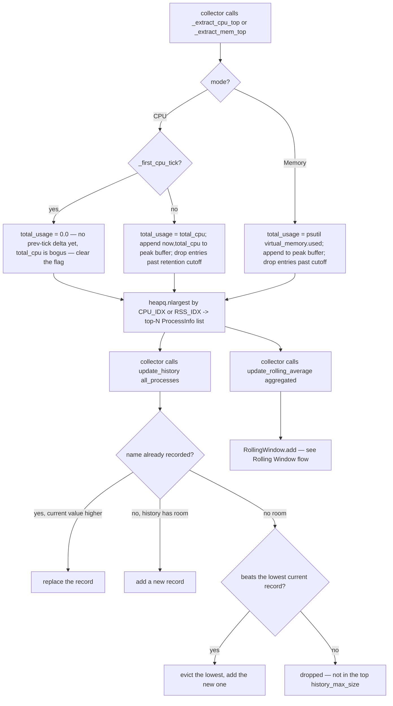

# Process Stats — Flow

**About:** [description](../__about/process_stats.md)

## One tick: extract → history → rolling average

Pseudocode (language-neutral):

    FUNCTION extract_top(aggregated, total, limit):
        IF mode == CPU AND this is the first tick since CPU mode was enabled:
            total_usage = 0                        // total_cpu has no previous-tick baseline yet — discard it
            clear the first-tick flag
        ELSE:
            total_usage = total
            append (now, total) to the peak buffer
            drop peak-buffer entries older than retention_seconds

        top = the `limit` highest-ranked entries from aggregated
              (ranked by CPU_IDX for CPU mode, RSS_IDX for Memory mode)
        RETURN top as ProcessInfo records

    FUNCTION update_history(processes):
        drop history records older than retention_seconds
        FOR EACH process IN processes WHERE value > 0:
            IF process.name already in history:
                IF process.value > recorded value -> overwrite the record
            ELSE IF history has room (< history_max_size):
                add a new record
            ELSE:
                find the lowest-value record currently held
                IF process.value beats it -> evict it, add the new record

    FUNCTION update_rolling_average(aggregated):
        build a per-name snapshot (CPU: cpu%, threads, count, 0 —
                                    Memory: rss, 0, count, vms)
        RollingWindow.add(now, snapshot)

The `_first_cpu_tick` guard exists because `total_cpu` on the very first
bulk-collect tick is `cpu_threads * 100 - 0` — no previous tick means no CPU
delta, so the Idle-process math in
[System Query](../__about/system_query.md) produces a value that looks like
100% total CPU on every core. Skipping ONE tick's total (not the whole
extract) avoids a false peak-history entry without discarding the process
list itself.
