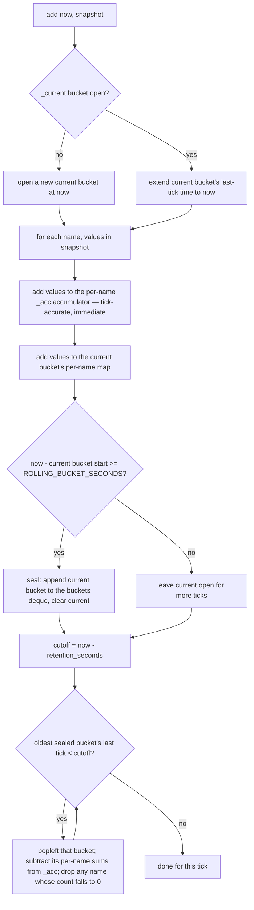

# Rolling Window — Flow

**About:** [description](../__about/rolling_window.md)

## `add()` — accumulator + sealed-bucket model

Pseudocode (language-neutral):

    FUNCTION add(now, snapshot):                 // snapshot = {name: field_values}
        IF no current bucket is open:
            open one starting at `now`
        current bucket's last-tick time = now

        FOR EACH name, values IN snapshot:
            _acc[name] += values                  // whole-window accumulator, tick-accurate
            current_bucket[name] += values         // this bucket's partial sum

        IF now - current_bucket.start >= ROLLING_BUCKET_SECONDS:
            seal current_bucket -> append to buckets queue
            current_bucket = none

        cutoff = now - retention_seconds
        WHILE oldest bucket in queue AND oldest bucket.last_tick < cutoff:
            expired = pop oldest bucket
            FOR EACH name, values IN expired:
                _acc[name] -= values                // remove exactly what that bucket added
                IF _acc[name] count reaches 0 -> drop name from _acc entirely

Reading the window (`items()`) always reads `_acc` directly — the bucket
queue exists only to make expiry cheap; it is never consulted for the
current totals.
