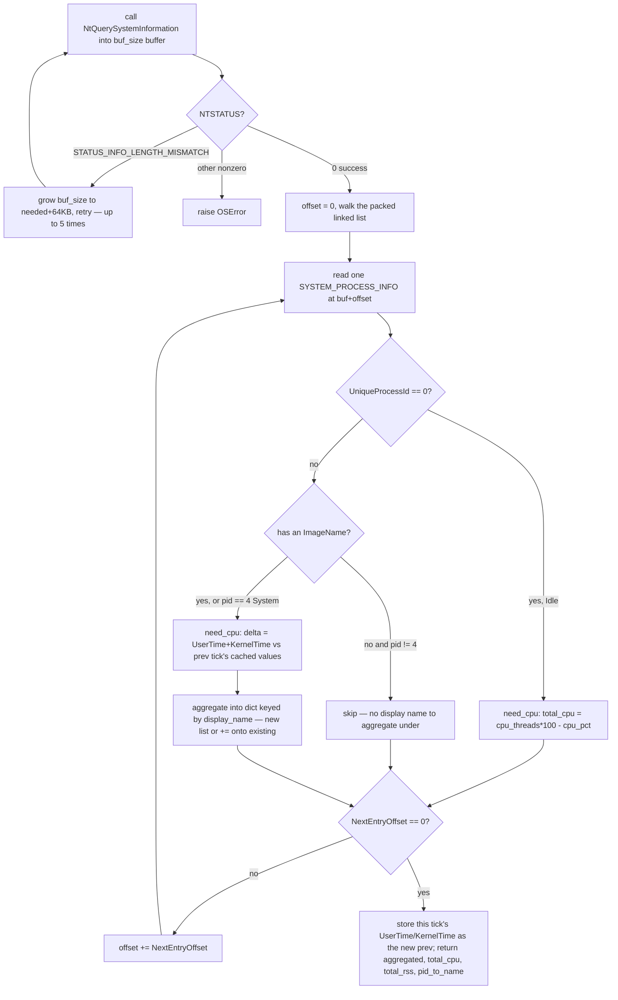

# System Query — Flow

**About:** [description](../__about/system_query.md)

## `collect_processes_bulk()` — one kernel call, one pass

Pseudocode (language-neutral):

    buf_size = 512 KB
    REPEAT up to 5 times:
        status = NtQuerySystemInformation(buf, buf_size)
        IF status == SUCCESS -> break
        IF status == STATUS_INFO_LENGTH_MISMATCH -> buf_size = needed + 64KB, retry
        ELSE -> raise error
    ELSE (5 retries exhausted) -> raise error

    offset = 0
    LOOP:
        entry = read SYSTEM_PROCESS_INFO at buf + offset
        IF entry.pid == 0 (Idle process):
            total_cpu = cpu_threads * 100 - entry.cpu_pct   // Idle time is the inverse of busy time
        ELSE IF entry has a usable name (image name, or pid == 4 "System"):
            IF need_cpu:
                delta = (entry.UserTime + entry.KernelTime) - previous tick's cached times for this pid
                cpu_pct = max(0, delta / elapsed_time * 100)
            display_name = alias-mapped name
            IF display_name already aggregated THIS tick -> add cpu/threads/rss/vms, increment count
            ELSE -> start a new aggregated entry for display_name
        // else: no name and not Idle/System -> contributes nothing, skipped
        IF entry.NextEntryOffset == 0 -> break loop (last entry)
        offset += entry.NextEntryOffset

    save this tick's UserTime/KernelTime per pid as "previous" for the next call
    RETURN aggregated, total_cpu, total_rss, pid_to_name

Notes on the pieces the diagram compresses: `total_rss` accumulates
`WorkingSetSize` alongside the aggregation step (aggregated processes only,
never PID 0); `pid_to_name` is filled in the same branch as the aggregation
so [Network Stats](../__about/network_stats.md) can resolve ETW's raw PIDs
to the same display names without a second lookup.
