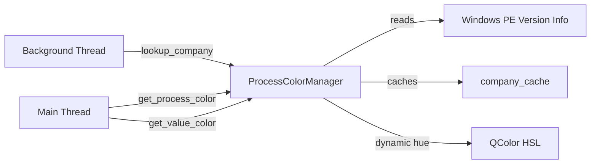

# Color Management

**Script:** [color_management.py (script)](color_management.py)

---

## Purpose

Handles all color logic for the Process Monitor:
- **Company-based coloring** — hues distributed dynamically as 360°/N where N grows as new companies are discovered; all named companies get a hue, no-company processes get a fixed gray.
- **Value-based coloring** — per-mode thresholds (CPU and Memory are independent), maps 0–100% usage to a color.
- **App color palette** — dark theme constants (`Colors` dataclass).

Config is read from `config/config.json` — edit that file to tune value color thresholds.

---

## Connections

### Uses

- `config/config.json` — `value_colors.ranges` for threshold/color pairs
- `psutil` — reads exe path for company name resolution
- Windows `version.dll` — reads `CompanyName` from PE version info

### Used by

- [MainWindow](main_window.md) — `get_value_color()`, `get_process_color()`
- [SettingsDialog](settings_dialog.md) — `get_value_ranges()`, `update_value_thresholds()`, `get_legend()`

---

## Constants

### Colors

Application color palette (dark theme). All values are CSS hex strings.

| Attribute | Value | Description |
|-----------|-------|-------------|
| `BACKGROUND` | `#1e1e2e` | Main window background |
| `CARD` | `#2a2a3e` | Card/panel background |
| `HEADER` | `#3a3a4e` | Header row background |
| `ACCENT` | `#e94560` | Accent/highlight color |
| `TEXT` | `#ffffff` | Primary text |
| `TEXT_MUTED` | `#aaaaaa` | Secondary text |
| `CURRENT_BG` | `#2d2d42` | Current processes section |
| `HISTORY_BG` | `#2a3a3e` | History section |

---

## Classes

### ProcessColorManager

Thread-safe singleton. Manages color assignment for all processes.

#### Constructor

No parameters — access via `ProcessColorManager()`. Singleton is initialized on first call.

#### Company-Based Coloring

Each named company gets a hue computed as:

```
hue = discovery_index / total_named_companies * 360°
```

Colors recalculate whenever a new company is discovered (N grows → all hues shift).
Fixed HSL parameters: saturation = 0.35, lightness = 0.70 (pastel, readable on dark backgrounds).

Processes with no company info at all get a fixed gray (`#999999`).

#### Methods

| Method | Thread | Description |
|--------|--------|-------------|
| `lookup_company(name, pid)` | Background | Register a process name and resolve its company via Windows PE version info. Fast no-op for already-cached names. |
| `get_process_color(name)` | Main | Return `QColor` for a process name. `None` if not yet looked up. Gray if no company info. |
| `get_value_color(pct, mode)` | Any | Return `QColor` for a usage percentage. `mode` = `"cpu"` or `"memory"`. |
| `update_value_thresholds(thresholds, mode)` | Main | Update 4 threshold values in-memory (session only). `thresholds` = 4 ascending ints in 1–99. |
| `get_value_ranges(mode)` | Main | Return `list[tuple[float, QColor]]` for UI display (ColorScaleWidget). |
| `get_legend()` | Main | Return `list[tuple[str, QColor, int]]` — `(company, color, process_count)` sorted by count descending. Includes `"Unknown"` entry at end for no-company processes. |

---

## Value Color Config

Thresholds and colors are read from `config/config.json`:

```json
{
  "value_colors": {
    "ranges": [
      {"max_pct": 3,   "color": "#5B9BD5"},
      {"max_pct": 8,   "color": "#6AAF6A"},
      {"max_pct": 20,  "color": "#C8B040"},
      {"max_pct": 40,  "color": "#D4803A"},
      {"max_pct": 100, "color": "#C85555"}
    ]
  }
}
```

CPU and Memory start from the same config but can be tuned independently at runtime via `update_value_thresholds()`.

---

## Data Flow


