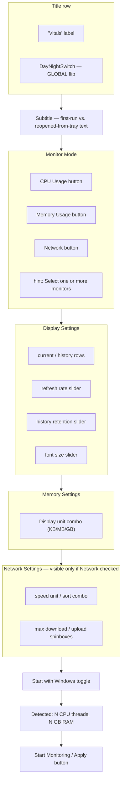
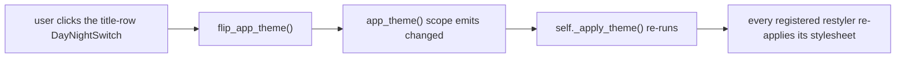
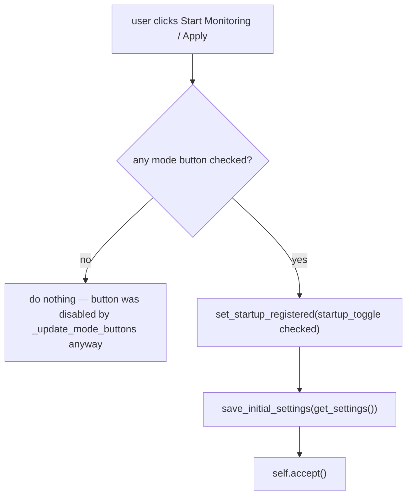

# Setup Dialog — Flow

**About:** [description](../__about/setup_dialog.md)

## Layout Sketch

`_setup_ui()` stacks these zones top to bottom in one `QVBoxLayout`. The
Network Settings block is the only one that is conditionally visible.

## Restyle Path

The setup screen is the only dialog in this folder that stays live after
construction — it registers for `self._theme.changed` because its own
switch can flip the app scope out from under it at any time.

Pseudocode (language-neutral):

    ON WIDGET CREATION (label, combo, spinbox, slider, mode button, ...):
        builder = FUNCTION that renders this widget's QSS from a palette
        _register_restyle(-> widget.setStyleSheet(builder(self._theme.palette)))
        RUN restyle once immediately

    ON self._theme.changed:                      # only the setup screen connects this
        FOR EACH registered restyle IN _restylers_list():
            restyle()                             # rebuild that one widget's stylesheet

Two restylers are registered LAST, after the whole layout exists, because
they touch widgets built further down `_setup_ui()`:
`_update_mode_buttons` (the 3 mode buttons + the network section's
visibility) and `_update_startup_toggle` (the autostart toggle's ON/OFF
style). Both already existed as click handlers that repaint one widget for
its checked state — registering them as restylers reuses that method rather
than duplicating it.

## `_on_start()`

Pseudocode:

    ON start_btn clicked:
        IF no mode button is checked -> return   # guard; button is disabled anyway
        register or unregister Windows autostart to match the toggle
        save_initial_settings(get_settings())     # writes last_setup.json
        accept()                                  # closes the dialog with QDialog.Accepted
