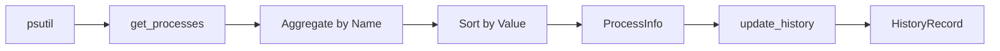

# Process Monitor

**Script:** [monitor.py (script)](monitor.py)

---

## Purpose

Core monitoring logic using psutil. Collects CPU and Memory usage per process, aggregates by process name, and tracks historical peak usage.

---

## Connections

### Uses

- [Styles](styles.md) - MEMORY_UNITS, get_process_display_name
- `psutil` - System process data

### Used by

- [MainWindow](main_window.md) - Creates monitor, calls get_processes()

---

## Classes

### MonitorMode (Enum)

```python
class MonitorMode(Enum):
    CPU = auto()
    MEMORY = auto()
```

---

### ProcessInfo

Information about a process or process group.

#### Attributes

| Attribute | Type | Description |
|-----------|------|-------------|
| `name` | str | Process display name |
| `value` | float | CPU % or Memory bytes |
| `threads` | int | Number of parallel threads |
| `timestamp` | float | Time of measurement |

---

### HistoryRecord

Historical peak usage record.

#### Attributes

| Attribute | Type | Description |
|-----------|------|-------------|
| `name` | str | Process name |
| `value` | float | Peak value |
| `timestamp` | float | When peak occurred |
| `threads` | int | Threads at peak |

#### Properties

- `time_str`: Formatted HH:MM string

---

### MonitorStats

Current monitoring statistics.

#### Attributes

- `total_usage`: Sum of all process usage
- `max_usage`: Highest total ever seen
- `max_usage_time`: When max occurred
- `process_count`: Number of unique processes

---

### ProcessMonitor

Main monitoring class.

#### Constructor

```python
ProcessMonitor(
    mode: MonitorMode = MonitorMode.CPU,
    cpu_threads: Optional[int] = None,  # Auto-detect
    ram_gb: Optional[int] = None,       # Auto-detect
)
```

#### Methods

| Method | Description |
|--------|-------------|
| `set_mode(mode)` | Switch CPU/Memory mode |
| `set_history_settings(max_size, retention)` | Configure history |
| `get_processes(limit)` | Get current top processes |
| `update_history(processes)` | Update peak records |
| `get_history()` | Get history records |
| `format_value(value, unit)` | Format for display |
| `get_total_display(unit)` | Get total usage string |
| `get_max_display(unit)` | Get peak usage string |
| `get_cpu_temperature()` | Get CPU temp in Celsius |

---

## Process Aggregation

Similar processes are grouped under common names:

| Original Name | Display Name |
|---------------|--------------|
| Code.exe, Code Helper.exe | Visual Studio Code |
| chrome.exe (multiple) | Chrome |
| msedge.exe | Microsoft Edge |
| nvcontainer.exe | NVIDIA |

---

## Thread Count

The `threads` field shows the actual number of parallel threads used by each process group, obtained via `psutil.Process.num_threads()`.

---

## CPU Temperature

Optional CPU temperature monitoring via:
1. `psutil.sensors_temperatures()` (Linux)
2. WMI `MSAcpi_ThermalZoneTemperature` (Windows)
3. OpenHardwareMonitor WMI interface (if running)

---

## Data Flow


