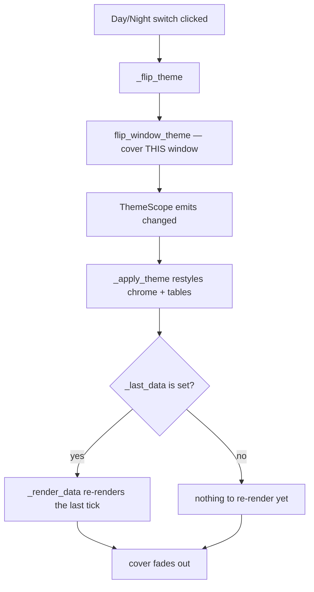
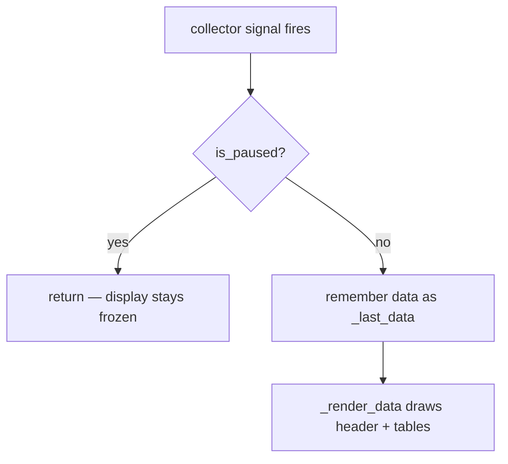

# Base Window — Flow

**About:** [description](../__about/base_window.md)

## Window layout

The header is a control column on the left and a data column on the right;
below it, a hidden status banner, then the vertical splitter that holds the
current-processes table above the toggleable Peak/Rolling stack.

📁 BaseMonitorWindow (QMainWindow, central widget)
  🟦 header_widget (QHBoxLayout)
    🎛️ controls_widget — left column, vertically centred
      ⏸️ / ⚙️ icons_row — pause/play button, settings button
      🌗 switch_row — the Day/Night switch (flips THIS window alone)
    📊 data_widget — right column, vertically centred, stretch = 1
      title_row — Title ................................. Total   (ONE row, owner 2026-07-24)
      sensor_widget — 3 equal columns, each: sensor name (tiny) over sensor value (body)
  🚨 status_banner — StatusBanner, hidden until `show_status(failure)` raises it
  ↕️ splitter (DoubleClickSplitter, vertical, double-click resets 50/50)
    📋 current_section
      "Current Processes" title
      current_table (Σ total row reserved when `_has_total_row()` is True)
    🔀 history_section
      bottom_header_row — "◀ Peak Usage ▶" / "◀ Rolling Average ▶" toggle button, Peak label
      bottom_stack (QStackedWidget)
        [0] history_table — Peak Usage
        [1] rolling_table — Rolling Average

When there are no HWiNFO sensors to show, `sensor_widget` is hidden and both
header columns stay `AlignVCenter`, so the two-row control block centres
against the single title row instead of leaving a gap.

## Theme-flip path

Pseudocode:

    ON header Day/Night switch clicked:
        _flip_theme():
            flip_window_theme(this window's ThemeScope, this window)
                -> cover THIS window with a snapshot (the incoming sun/moon)
                -> flip the scope's stored theme choice
                -> scope emits "changed"
                -> uncover with a fade once the repaint below is done

    WHEN ThemeScope "changed" fires -> _apply_theme():
        restyle window chrome from self._theme.palette:
            QPalette, header card, title/total labels, sensor labels,
            status banner, splitter handle, bottom-toggle button
        FOR EACH table IN (current, history, rolling):
            style_table(table, new palette, font_base)   # QSS only
        IF _last_data is not None:
            _render_data(_last_data)
            # per-cell brushes are set directly on QTableWidgetItems, not by
            # QSS, so restyling the table cannot reach them — only a re-render
            # recomputes every process/value color in the new palette

Without the re-render, table cells would keep the OLD theme's colors until
the next collector signal — at a slow refresh rate that is a window visibly
half-flipped, which is exactly the bug this path exists to prevent.

## One tick

Pseudocode:

    ON collector data-ready signal -> _on_data_ready(data):
        IF is_paused -> return
        _last_data = data      # so a LATER theme flip can re-render this tick
        _render_data(data)     # subclass fills the header and the three tables
