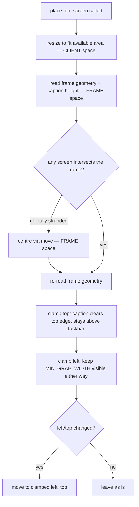

# Placement — Flow

**About:** [description](../__about/placement.md)

## The frame-vs-client distinction

This is the centrepiece of the whole module. Qt exposes TWO different
rectangles for the same window, and mixing them is the recurring bug:

- **CLIENT rect** — `geometry()` / `setGeometry()` / `resize()`. The caption
  bar and window borders are NOT included.
- **FRAME rect** — `pos()` / `move()` / `frameGeometry()`. On Windows this
  starts one caption height ABOVE the client rect.

So `setGeometry(0, 0, w, h)` — an entirely ordinary saved position — leaves
`frameGeometry() == (0, -30, w, h + 30)`: the whole title bar, its drag strip
and its close button sit above the screen. A naive guard that asks "does the
FRAME touch a screen?" is still true here, so it does nothing, and the window
is stranded: `Qt.Tool` means no taskbar button and no Alt-Tab entry, and
Windows only ever rescues a window the user can still focus. `place_on_screen`
is the one place that keeps FRAME and CLIENT straight throughout.

## The clamp

Pseudocode (language-neutral):

    place_on_screen(window):
        available = target_screen(window).availableGeometry()
        margins   = window's native frame margins (empty before first show)

        # 1. SIZE FIRST, in CLIENT space — resize() matches what a saved
        #    width/height means, and the position clamp below must see the
        #    frame the window will actually end up with.
        width  = clamp(window.width(),  MIN_WIDTH,  available.width  - margins.left - margins.right)
        height = clamp(window.height(), MIN_HEIGHT, available.height - margins.top  - margins.bottom)
        IF (width, height) changed -> window.resize(width, height)

        # 2. From here on everything is FRAME space.
        frame   = window.frameGeometry()
        caption = margins.top, OR frame.height() - window.height() if margins are empty
                  (pre-show fallback: the frame already reveals the strut)

        # 3. Fully stranded — no screen's available area overlaps the frame
        #    at all (a monitor was unplugged, or the layout came from a
        #    different desktop). Nothing about the old position is worth
        #    preserving, so centre it and let the clamp below finish the job.
        IF no screen.availableGeometry() intersects frame:
            move window to the centre of `available`      # FRAME space
            frame = window.frameGeometry()                 # refresh after the move

        # 4. VERTICAL clamp — the caption must clear the top edge, and the
        #    window must not push its caption below the taskbar.
        top = min( max(frame.y(), available.top),
                   max(available.top, available.bottom - caption + 1) )

        # 5. HORIZONTAL clamp — keep a real grabbable strip on screen,
        #    whichever side the window is parked toward.
        grab = min(MIN_GRAB_WIDTH, frame.width())
        left = min( max(frame.x(), available.left - frame.width() + grab),
                    available.right - grab + 1 )

        IF (left, top) != (frame.x(), frame.y()):
            window.move(left, top)

Two things this clamp deliberately does NOT do: it never moves a window that
is merely hanging off an edge (a gadget parked half off-screen on purpose is
a valid layout — only an unreachable CAPTION is corrected), and it never
touches size again after step 1 (steps 4–5 are pure position clamps).
